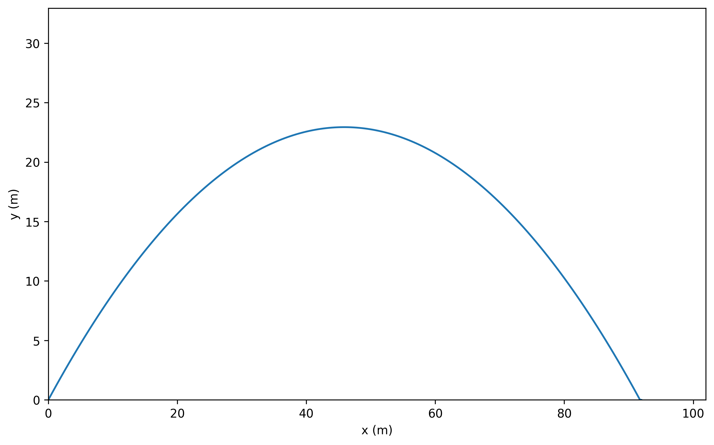
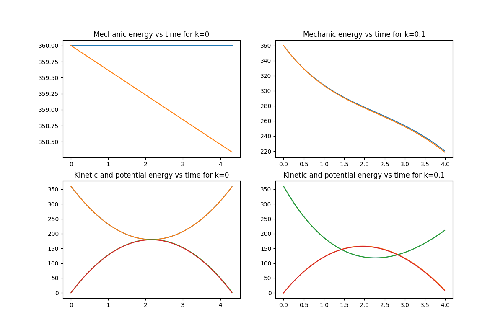
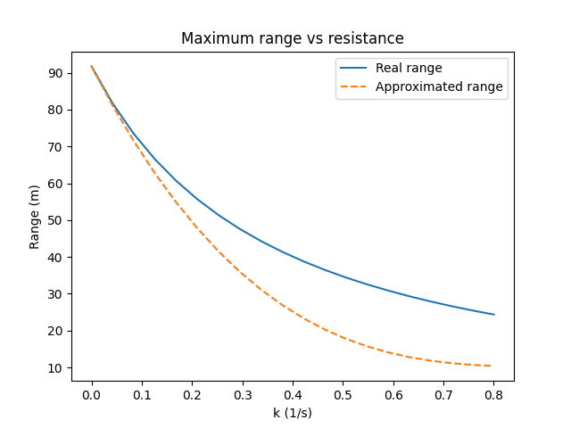
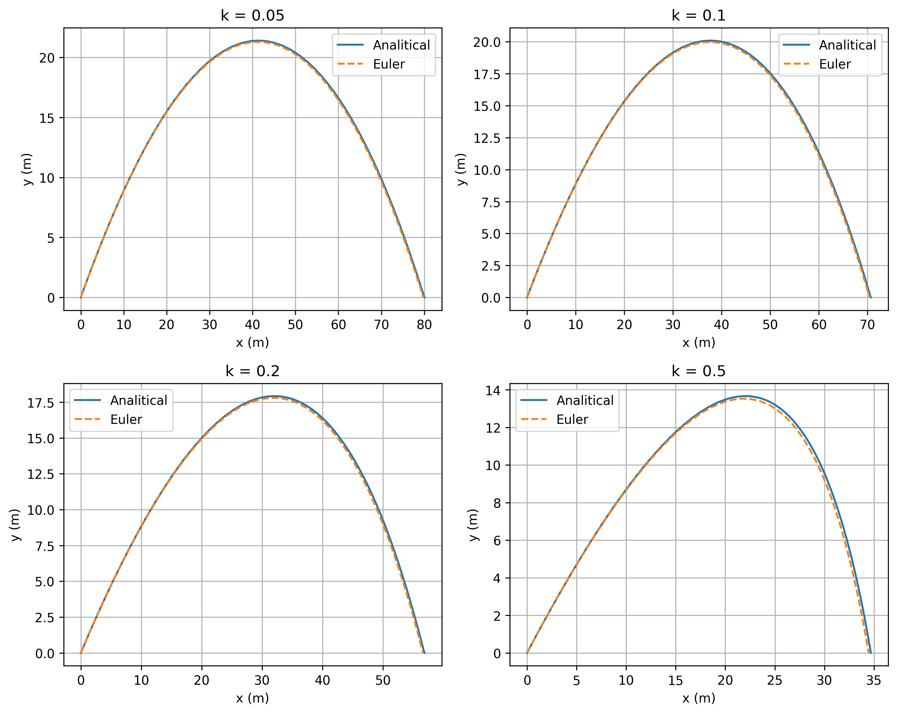
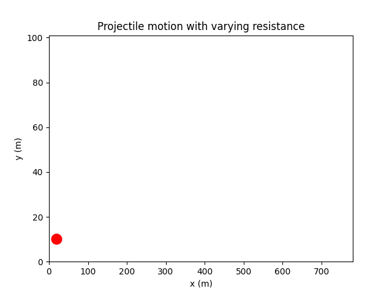
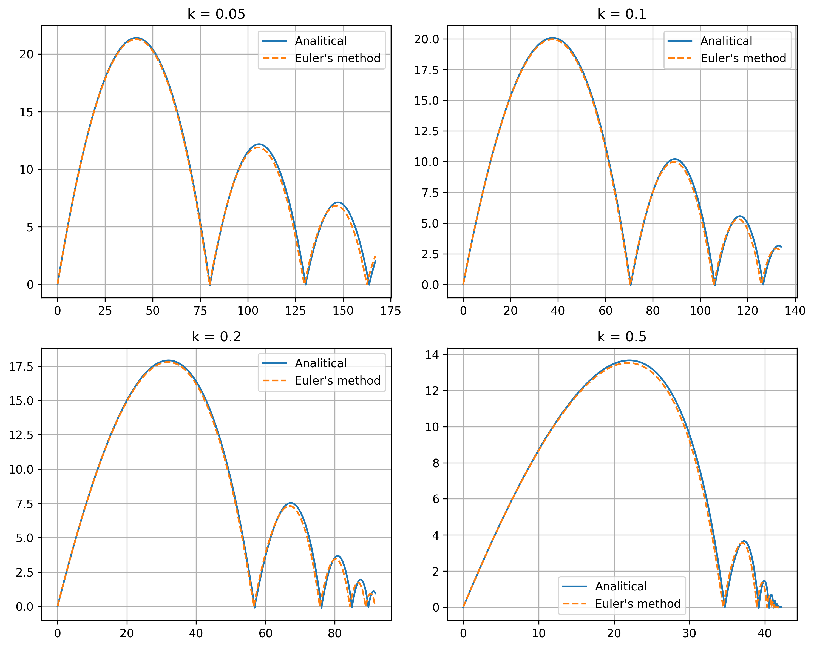
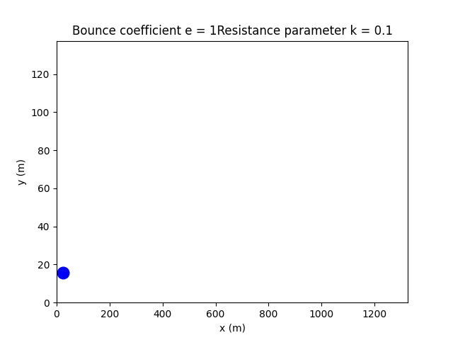

<h2>Parabolic motion</h2>

Anyone who has ever studied basic kinematics has heard about <em>parabolic motion</em>. It is the result of throwing a projectile with initial position
$(x_0, y_0)$, initial speed $(v_0)$, and launch angle $(\alpha)$. The equations of motion along the x and y axes in the ideal case are:

Horizontal velocity (no horizontal acceleration):

$$
v_x(t) = v_{0x} = v_0 \cos\alpha
$$

Vertical velocity (affected by gravity):

$$
v_y(t) = v_{0y} - g t = v_0 \sin\alpha - g t
$$

Integrating these expressions, we obtain the position:

$$
x(t) = x_0 + v_0 \cos\alpha t
$$

$$
y(t) = y_0 + v_0 \sin\alpha t - \frac{1}{2} g t^2
$$

This produces the familiar parabolic trajectory, which can be represented as:

<table>
  <tr>
    <td align="center">
       
      <strong>Projectile motion without air resistance</strong>
    </td>
  </tr>
</table>

Too boring, isn’t it?

Well, let’s make the system more interesting.

<h2>🧠 Resistance coefficient (linear drag)</h2>

Imagine you are walking peacefully down the street, throwing a ball above your head, when suddenly a strong gust of wind bends its trajectory.
You still manage to catch it because you are faster, but you start wondering if there is a physical model that can describe this motion.
There is: we introduce a <strong>linear drag force</strong>.

In this case, the acceleration depends on the velocity:

$$
m a_x = -k m v_x
$$

$$
m a_y = -k m v_y - m g
$$

where k is the resistance coefficient. Dividing by m, we obtain:

$$
a_x = \frac{dv_x}{dt} = -k v_x
$$

$$
a_y = \frac{dv_y}{dt} = -k v_y - g
$$

We can solve these equations both analytically and numerically. We will do both.

<h3>Analytical solution with linear drag</h3>

<h4>Horizontal motion</h4>

We solve

$$
\frac{dv_x}{dt} = -k v_x
$$

This is a first-order linear differential equation with solution:

$$
v_x(t) = v_{0x} e^{-k t}
$$

Integrating once more:

$$
x(t) = x_0 + \int_0^t v_{0x} e^{-k s} ds
     = x_0 + \frac{v_{0x}}{k} \left(1 - e^{-k t}\right)
$$

<h4>Vertical motion</h4>

Now we solve

$$
\frac{dv_y}{dt} + k v_y = -g
$$

The solution is:

$$
v_y(t) = \left(v_{0y} + \frac{g}{k}\right) e^{-k t} - \frac{g}{k}
$$

Integrating to obtain the vertical position:

$$
y(t) = y_0 + \int_0^t \left[\left(v_{0y} + \frac{g}{k}\right) e^{-k s} - \frac{g}{k}\right] ds
$$

$$
y(t) = y_0 + \frac{v_{0y} + \frac{g}{k}}{k} \left(1 - e^{-k t}\right) - \frac{g}{k} t
$$

These are the analytical equations of motion with linear air resistance.

<h3>Maximum height</h3>

The maximum height is reached when the vertical velocity becomes zero:

$$
v_y(t_h) = 0
$$

$$
\left(v_{0y} + \frac{g}{k}\right) e^{-k t_h} - \frac{g}{k} = 0
$$

Solving for t_h:

$$
e^{-k t_h} = \frac{\frac{g}{k}}{v_{0y} + \frac{g}{k}} = \frac{g}{k v_{0y} + g}
$$

$$
t_h = \frac{1}{k} \ln\left(\frac{k v_{0y} + g}{g}\right)
$$

Substituting this time into y(t), we obtain the maximum height $H_{\max}$:

$$
H_{\max} = y(t_h)
= y_0 + \frac{v_{0y} + \frac{g}{k}}{k} \left(1 - e^{-k t_h}\right) - \frac{g}{k} t_h
$$

This expression can be simplified further, but in this form it already gives the exact maximum height with linear drag.

<h3>Range and transcendental equation for the flight time</h3>

To compute the range, we need the total flight time T, i.e, the time when the projectile returns to the ground:

$$
y(T) = 0
$$

Assuming y_0 = 0, we have:

$$
0 = \frac{v_{0y} + \frac{g}{k}}{k} \left(1 - e^{-k T}\right) - \frac{g}{k} T
$$

Multiplying by k:

$$
\left(v_{0y} + \frac{g}{k}\right) \left(1 - e^{-k T}\right) - g T = 0
$$

Rewriting:

$$
T = \left(\frac{v_{0y}}{g} + \frac{1}{k}\right) \left(1 - e^{-k T}\right)
= \frac{k v_{0y} + g}{g k} \left(1 - e^{-k T}\right)
$$

This is a <strong>transcendental equation</strong> in T, so it cannot be solved analytically in closed form. However, we can approximate it.

<h3>Approximation using a Taylor expansion</h3>

We expand the exponential in a Taylor series up to third order:

$$
e^{-k T} \approx 1 - k T + \frac{(k T)^2}{2} - \frac{(k T)^3}{6}
$$

Substituting into the transcendental equation:

$$
T = \left(\frac{v_{0y}}{g} + \frac{1}{k}\right)
\left[1 - \left(1 - k T + \frac{(k T)^2}{2} - \frac{(k T)^3}{6}\right)\right]
$$

$$
T = \left(\frac{v_{0y}}{g} + \frac{1}{k}\right)
\left(k T - \frac{(k T)^2}{2} + \frac{(k T)^3}{6}\right)
$$

Keeping terms up to first order in k, we obtain the approximate flight time:

$$
T \approx \frac{2 v_{0y}}{g} \left(1 - \frac{k v_{0y}}{3 g}\right)
$$

Once we have the time, we can approximate the range R. The horizontal position with drag is:

$$
x(t) = x_0 + \frac{v_{0x}}{k} \left(1 - e^{-k t}\right)
$$

Expanding again for small k, we can write:

$$
R \approx v_{0x} \left(T - \frac{1}{2} k T^2\right)
$$

Substituting the approximate T into this expression gives an approximate range with drag.

On the other hand, without air resistance, the well-known range is:

$$
R_0 = \frac{v_0^2}{g} \sin(2\alpha)
$$

Comparing both, we can write an approximate correction:

$$
R' \approx R_0 \left(1 - \frac{4 k v_{0y}}{3 g}\right)
$$

So, the error up to first order in k is:

$$
\Delta R = R_0 - R' \approx R_0 \frac{4 k v_{0y}}{3 g}
$$

<h3>Numerical solution using Euler’s method</h3>

We can also solve the problem numerically using Euler’s method. We rewrite the system as:

$$
\frac{dx}{dt} = v_x, \quad \frac{dy}{dt} = v_y
$$

$$
\frac{dv_x}{dt} = -k v_x
$$

$$
\frac{dv_y}{dt} = -k v_y - g
$$

Using a time step $(\Delta t)$, the Euler update equations are:

$$
v_x^{n+1} = v_x^n - k v_x^n \Delta t
$$

$$
v_y^{n+1} = v_y^n - (k v_y^n + g) \Delta t
$$

$$
x^{n+1} = x^n + v_x^n \Delta t
$$

$$
y^{n+1} = y^n + v_y^n \Delta t
$$

With these numerical equations, the problem becomes straightforward to implement in Python.

<table>
  <tr>
    <td align="center">
       
      <strong>Energy evolution with drag</strong>
    </td>
    <td align="center">
       
      <strong>Range: analytical vs approximate</strong>
    </td>
  </tr>
</table>

<h3>Comparing analytical and numerical trajectories</h3>

Now that we have both the analytical and numerical equations of motion, we can compare how the trajectory changes for different values of \(k\),
and how much the numerical solution differs from the analytical one.

  
  
<strong>Projectile motion with drag – animation</strong>

  
  
<strong>Projectile motion with drag – animation</strong>

Why did we compute two different solution methods instead of just one? First, knowledge never takes up space. Second, because of simulation:
when you want a smooth animation, you want to avoid gaps, inconsistencies, and irregularities. We want a continuous and visually coherent motion.
Since the animation shows how the trajectory changes between different media and different values of k, we would have obtained irregular
trajectories if we had not used a numerical method.

  
  
<strong>Projectile motion with drag – animation</strong>

<h2>🧠 Bounce + Resistance coefficient</h2>

What if instead of catching the ball we had failed? We would have seen how the ball rebounds on the street, performing smaller and smaller
parabolic trajectories until it finally loses all its energy (the system is not perfect, sorry). How can we describe this behaviour?

Maintaining the same drag model as before, the only additional ingredient we need is the <strong>coefficient of restitution</strong> e.
When the projectile hits the ground, we compute the vertical velocity just before impact, $- v_y$. The rebound velocity is simply:

$$
v_y^{new} = - e v_y^{old}
$$

The horizontal velocity keeps evolving under drag, and the vertical velocity is reset according to the expression above. With each bounce,
the energy decreases, producing progressively smaller trajectories.

   
  <strong>Rebound under linear drag</strong>

   
  <strong>Animation of multiple rebounds with drag</strong>

