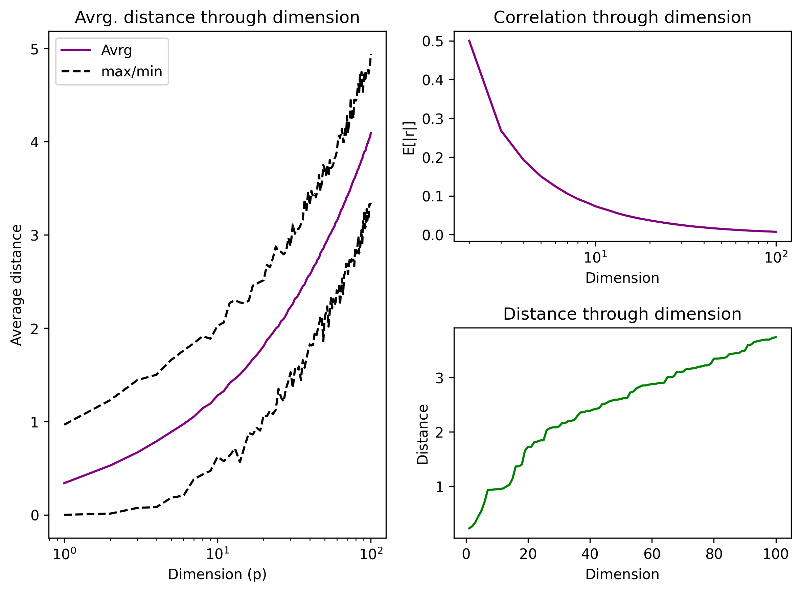
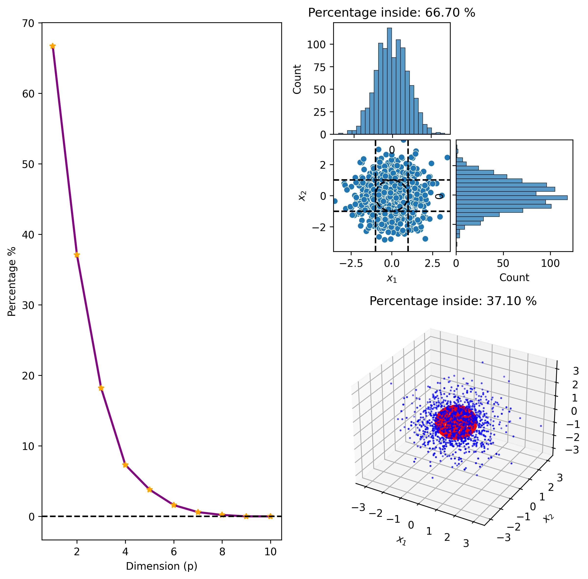

# The Curse of Dimensionality: An Intuitive Introduction

Hi there! Today’s lesson is on the **Curse of Dimensionality**.

The term sounds ominous, but the concept is actually quite simple: **as you increase the number of dimensions, everything becomes harder, and your intuition often fails you.**

## A Simple Analogy: The Unit Hypercube

Let’s start with a **unit square** in 2D space. If you pick two random points inside it, the Euclidean distance between them will always be less than $\sqrt{2}$ (the diagonal). More precisely, the *average* distance tends to be approximately **0.521 units** [1]. All good so far?

Now, imagine expanding that square into a **unit cube** (3D space). The average distance between two random points increases slightly to about **0.662 units** [1].

If you continue this process—increasing the dimension of the unit hypercube to $p$ dimensions the average distance between two random points **grows without bound**. Specifically, as the dimension $d$ increases, the average distance tends toward $\sqrt{d/6}$ [1][2].

> **Key Insight:** In high dimensions, the average distance between random points gets very large. This is a surprising behavior of data in higher-dimensional spaces.

## The Geometry of High Dimensions: Spheres vs. Hypercubes

To understand why this happens, consider the relationship between a unit circle (2D), a unit sphere (3D), and their higher-dimensional counterparts.

Isn’t it counterintuitive that the hypotenuse (the diagonal) is so much larger than the sides? In high dimensions, this effect is extreme. While the "volume" of a unit sphere shrinks toward zero relative to a unit hypercube as dimensions increase, the *corners* of the hypercube stretch further and further away from the center.

> **Note:** In a unit hypercube, the maximum distance (from one corner to the opposite) is $\sqrt{d}$. As dimensions grow, the average distance ($\sqrt{d/6}$) becomes a significant fraction of this maximum, meaning almost all points are located near the "edges" or "corners" of the space [1].

## What the Code Shows

In the code above, you will find two classes discussing the **curse of dimensionality** in a hypersphere and in a hypercube. Both outputs reveal two not-at-all-surprising results (graphics above):

1.  **Average Distance Grows:** The average distance between random points increases with the dimension $d$, following the asymptotic behavior $\approx \sqrt{d/6}$ [2].
2.  **Distance Concentration:** The *relative* difference between the closest and farthest points shrinks. In very high dimensions, almost all pairs of points are roughly the same distance apart. This is often misinterpreted as "correlation", but strictly speaking, it is the **concentration of measure**: the standard deviation of distances remains small compared to the mean, making distance metrics less discriminative [1].

## Why Does This Matter?

This is crucial because the curse of dimensionality appears in many fields of **Machine Learning**.

Every feature your data has is effectively another dimension. When you increase the number of dimensions (features), the data becomes exponentially sparse.

*   **Example:** Imagine a dataset with **784 dimensions** (like a $28 \times 28$ pixel image). How can you handle such high-dimensional data? How can you reduce the dimensionality effectively? 
*   **Applications:** The curse is visible in **anomaly detection**, **data mining**, and **nearest neighbor search**. In high dimensions, the concept of "nearest neighbor" becomes meaningless because all neighbors are equidistant [1] - another counterintuitive result.

## Navigating the Curse

To tackle these issues, data scientists use techniques like:

*   **Dimensionality Reduction** (e.g., PCA, Autoencoders).
*   **Manifold Learning** (e.g., Isomap, t-SNE), which assumes data lies on a lower-dimensional structure.
*   **Feature Selection** to remove irrelevant dimensions.
*   **Regularization** to prevent overfitting in sparse spaces.

If you want to search for more about these terms, don’t hesitate to look up the bibliography below.

---

## References & Further Reading

*   **Bellman, R. E.** (1961). *Adaptive Control Processes: A Guided Tour*. (Origin of the term "Curse of Dimensionality")
*   **MathWorld: Hypercube Line Picking** – For the exact mean distances in hypercubes.
*   **Stack Exchange: Distances between random points in a hypercube** – For the derivation of $\sqrt{d/6}$.
*   **Scikit-Learn Documentation** – For practical implementations of PCA and Manifold Learning.

---

## Key Corrections Made

1.  **Mathematical Accuracy:**
    *   Changed "average distance tends to infinite" to "grows as $\sqrt{d/6}$" (which grows without bound but is finite for any fixed $d$).
    *   Corrected the 2D average distance from 0.5 to **0.521** (Robbins' constant approximation).
    *   Corrected the 3D average distance from 0.66 to **0.662**.
    *   Removed the incorrect claim that "average correlation follows $1/\sqrt{d}$." Instead, clarified that distances *concentrate* (variance relative to mean shrinks), which is the actual phenomenon.
2.  **Grammar & Style:**
    *   Fixed run-on sentences and awkward phrasing (e.g., "as long as as increase the dimension all gets mores difficult").
    *   Improved flow and clarity for educational purposes.
3.  **Clarity:**
    *   Explicitly distinguished between the *mean* distance growing and the *relative* distance shrinking (concentration of measure).
    *   Clarified the analogy of the "hypotenuse vs. cathetus" to better explain why corners dominate in high dimensions.
