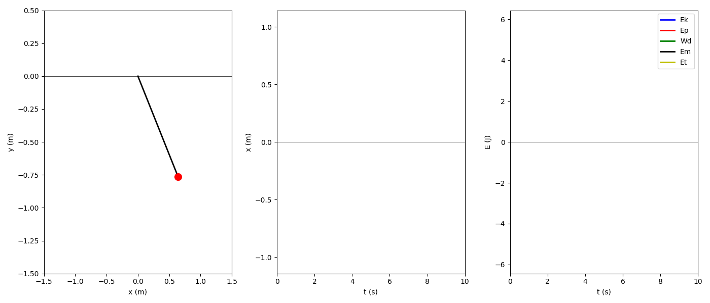
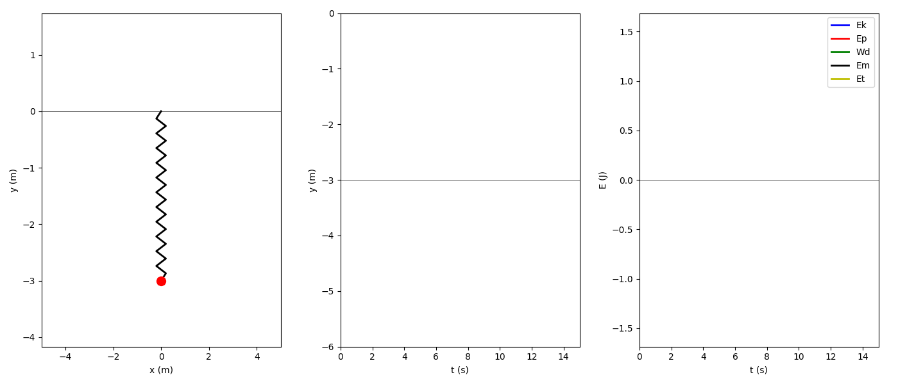
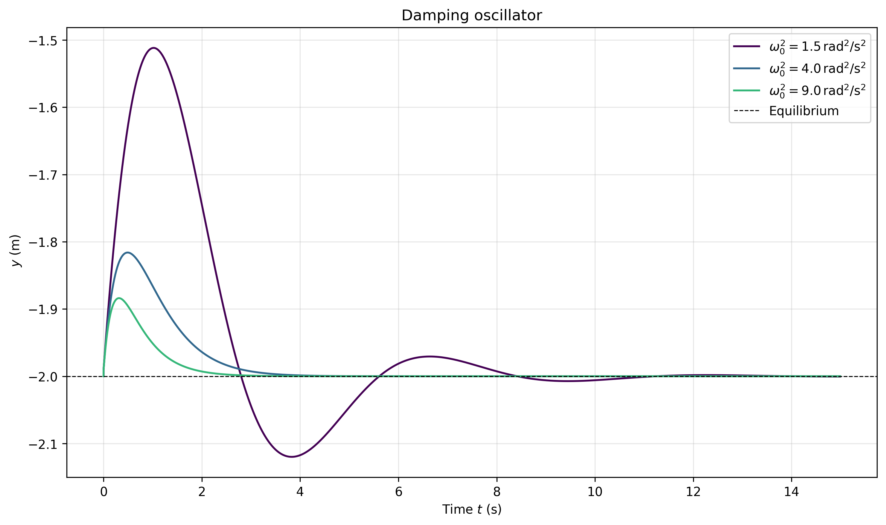
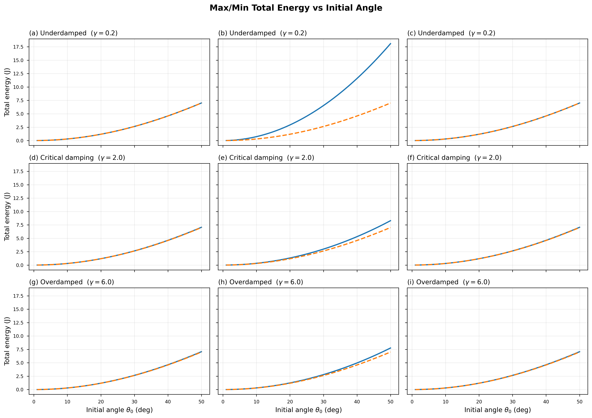
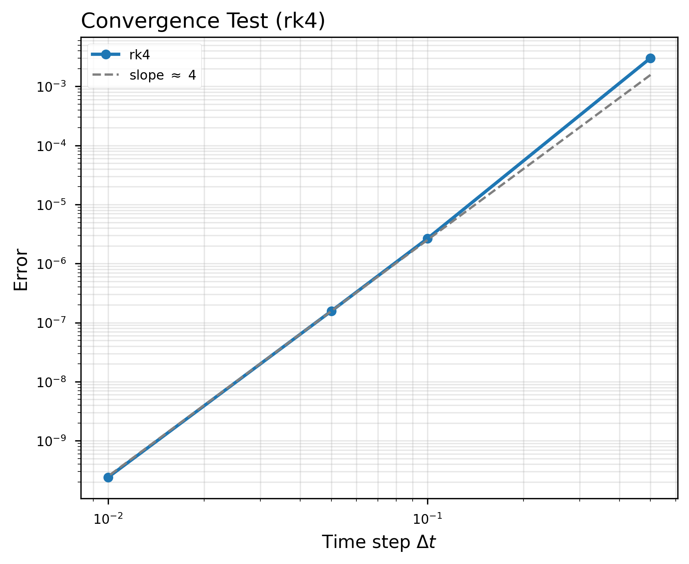
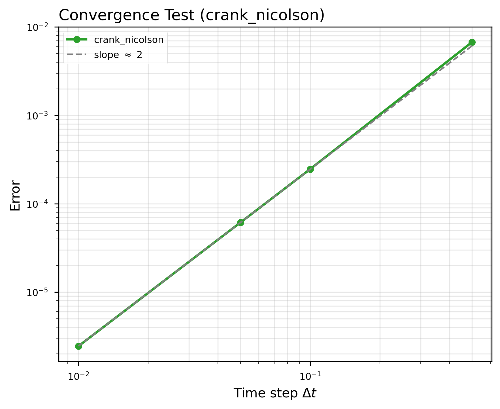
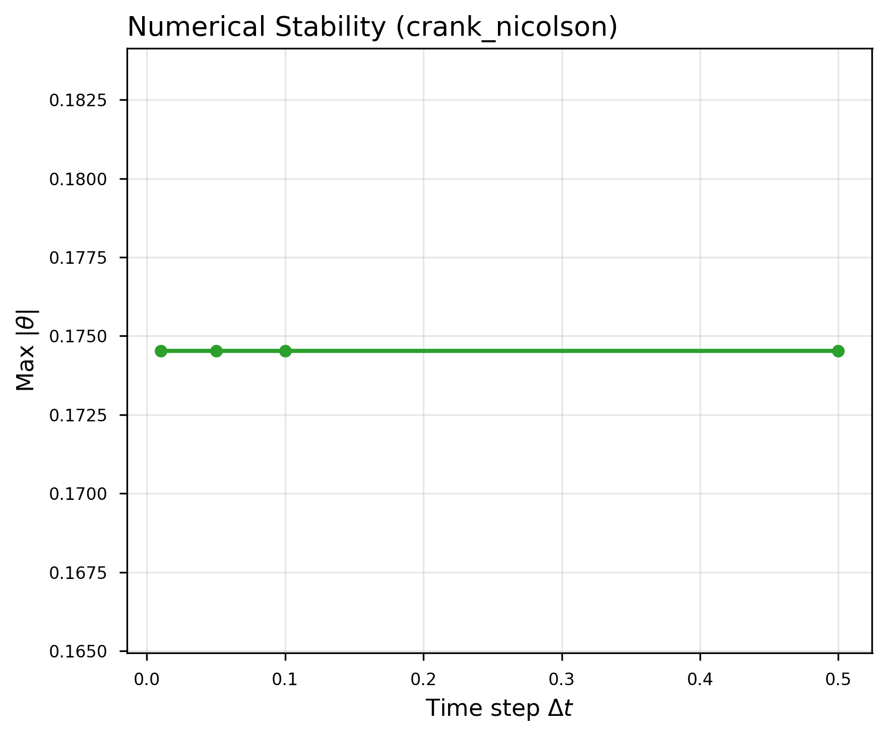
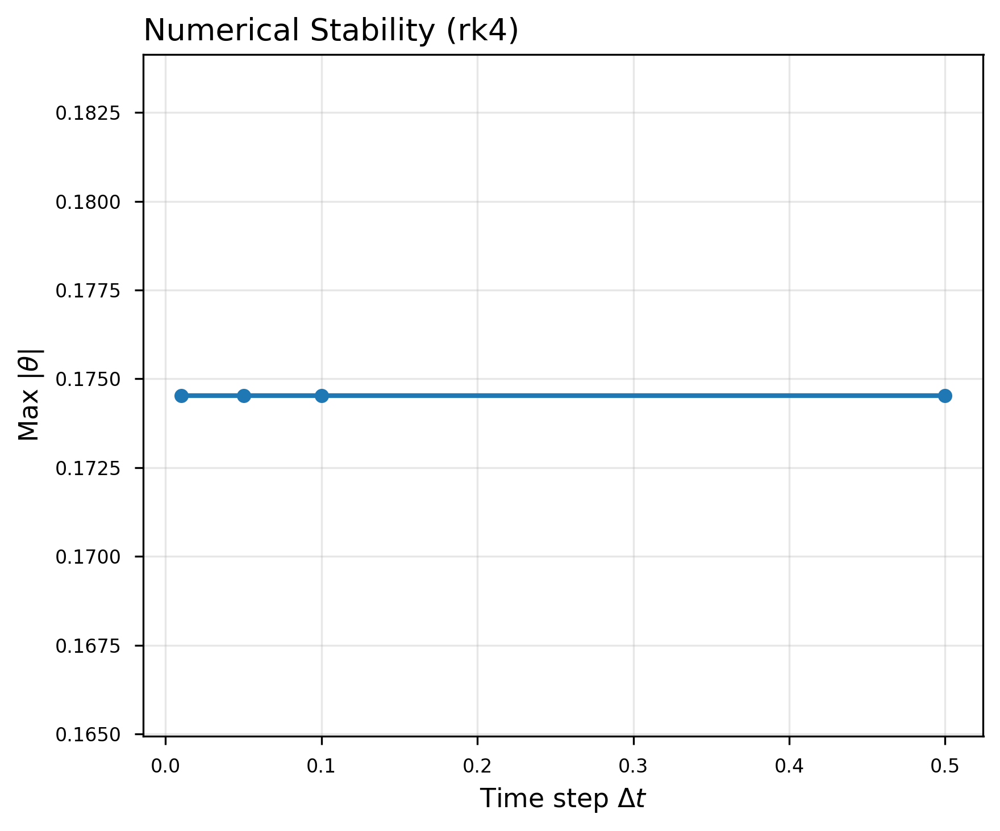

<!DOCTYPE html>
<html lang="en">
<head>
<meta charset="UTF-8">
<title>Damping Vibration</title>

</head>

<body>

<h1>Damping Vibration</h1>

Hello there,

Let us talk about the next section of oscillatory systems: <b>Damping Vibration</b>.
We know that in real life motion is not infinite. There exists a concept called 
<b>energy dissipation</b>. Effects such as air friction, internal material friction, 
and many other mechanisms gradually remove energy from the system. As a result, 
every oscillatory motion eventually stops.

But how can we represent this kind of motion mathematically?

As usual, we assume that if the friction forces are relatively small, the motion
remains approximately periodic while its amplitude slowly decreases with time.
Under this assumption, we consider the same systems studied in the previous section:

<ul>
<li>Mass–spring system</li>
<li>Simple pendulum</li>
</ul>

The only additional ingredient is the presence of a <b>dissipative force</b>:

<b>Fd = −γ v</b>

This force is non-conservative and acts opposite to the direction of motion,
therefore the work performed by this force is negative and removes energy
from the system.

<h2>Equations of Motion</h2>

Applying Newton's second law and establishing the dynamic equilibrium,
the equations of motion become:

<h3>Mass–Spring System</h3>

m x'' + γ x' + kx = 0

<h3>Pendulum System</h3>

θ'' + (γ/m) θ' + (g/L) sin(θ) = 0

<h2>Important Parameters</h2>

Before discussing how to solve these differential equations, it is useful
to define two important parameters:

<ul>
<li><b>Damping parameter</b>: β</li>
<li><b>Natural angular frequency</b>: ω0</li>
</ul>

For the spring system:

β = γ / (2m)

ω0² = k / m

Using these parameters the equation becomes:

x'' + 2βx' + ω0² x = 0

These parameters determine the dynamical regime of the system:

<ul>
<li>If β &lt; ω0 → <b>Underdamped motion</b></li>
<li>If β = ω0 → <b>Critical damping</b></li>
<li>If β &gt; ω0 → <b>Overdamped motion</b></li>
</ul>

<h2>Types of Motion</h2>

<h3>Underdamped Motion</h3>

In this regime the system still oscillates, but the amplitude decays
exponentially with time. The characteristic time that describes this
decay is called the <b>relaxation time</b>.

For the linear equation of the spring system the analytical solution is:

x(t) = A e-βt cos(ωt + φ)

This analytical solution exists only for the linear equation.
For nonlinear systems such as the pendulum, numerical methods must be used.

<h2>Numerical Solutions</h2>

The previous figure shows the different regimes for the pendulum system,
each solved using different numerical methods.
Since the pendulum equation is nonlinear, we cannot use the analytical
solution.

We can observe that the Euler method performs poorly, especially for the
first regime. This occurs because Euler's method accumulates large
numerical errors and is not very stable for oscillatory systems.

<h2>How Do We Solve It?</h2>

This time we will not discuss the basic numerical methods in detail,
since they were already explained in the previous section
(Euler method and Runge–Kutta RK4).

However, another numerical method is introduced here:
<b>Crank–Nicolson method</b>.

The Crank–Nicolson method was developed by
John Crank and Phyllis Nicolson in 1947. It is an implicit
finite-difference method commonly used for solving differential
equations in numerical analysis.

It is based on averaging the explicit and implicit Euler methods,
which provides improved stability and second-order accuracy.

<h3>Crank–Nicolson Scheme</h3>

The following derivation corresponds to the notes used in the implementation:

<h2>Energy Validation</h2>

How do we know if the numerical solution is correct?

One way is to analyze the system energy and apply the
<b>work–energy theorem</b>. The dissipative force performs negative
work, therefore the total mechanical energy must decrease with time.

This figure also shows how poorly the Euler method performs.
Because it is not energy-consistent, it can artificially destroy
or generate energy.

<h2>Error Analysis</h2>

The first figure corresponds to the spring system. Since the analytical
solution is known, we can compute the absolute error of the numerical
solutions.

For the pendulum system we cannot compute analytical errors. Instead,
we analyze the <b>stability</b> and <b>convergence</b> of the methods.

From these results we observe that <b>RK4</b> generally provides higher
accuracy and stability. However, the <b>Crank–Nicolson method</b> also
performs very well and remains a strong alternative, especially in
problems where stability is essential.

</body>
</html>