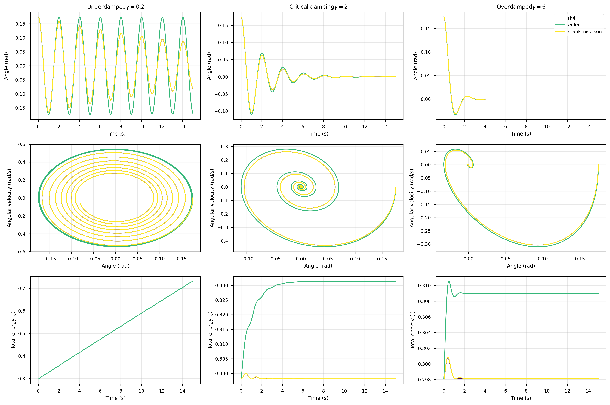
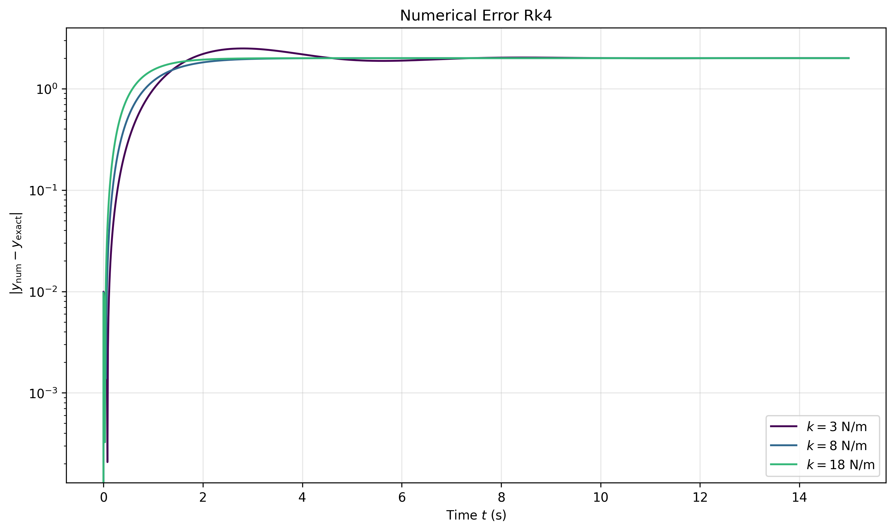

<h1>Damping Vibration</h1>

Up to this point we have studied ideal oscillatory systems — springs and pendulums that move forever without losing energy.
In the real world, however, motion never persists indefinitely. Every oscillation gradually fades away due to mechanisms
that remove energy from the system.

Air resistance, internal friction in materials, and many other processes lead to what is known as <strong>energy dissipation</strong>.
No matter how small these effects are, they eventually cause the motion to stop.

The question then becomes:  
How can we model oscillations that slowly disappear over time?

<h2>Introducing Dissipation</h2>

To incorporate this effect we assume that the system experiences a resistive force proportional to velocity

$$
F_d = -\gamma v
$$

This force acts opposite to the direction of motion and is therefore <em>non-conservative</em>.
Because of this, the work performed by the force is negative and the mechanical energy of the system decreases with time.

Starting from the oscillatory systems studied in the previous section — the mass–spring system and the simple pendulum —
we now add this dissipative term to the equations of motion.

<h2>Equations of Motion</h2>

For the damped mass–spring oscillator we obtain

$$
m\frac{d^2x}{dt^2} + \gamma\frac{dx}{dt} + kx = 0
$$

For the pendulum the equation becomes

$$
\frac{d^2\theta}{dt^2} + \frac{\gamma}{m}\frac{d\theta}{dt} + \frac{g}{L}\sin(\theta) = 0
$$

<h2>Characteristic Parameters</h2>

Before attempting to solve these equations it is useful to define two important parameters:

<ul>
<li>Damping parameter: $\beta$ - Environment's resistance to such fluctuations </li>
<li>Natural angular frequency: $\omega_0$ - natural tendency to fluctuate </li>
</ul>

For the <em>spring</em> system these parameters are defined as

$$
\beta = \frac{\gamma}{2m}
$$

$$
\omega_0^2 = \frac{k}{m}
$$

Using these definitions the differential equation becomes

$$
\frac{d^2x}{dt^2} + 2\beta\frac{dx}{dt} + \omega_0^2 x = 0
$$

For the <em>pendulum</em> system these parameters are defined as

$$
\beta = \frac{\gamma}{2m}
$$

$$
\omega_0^2 = \frac{g}{L}
$$

Using these definitions the differential equation becomes

$$
\frac{d^2 \theta}{dt^2} + 2\beta\frac{d\theta}{dt} + \omega_0^2 sin(\theta) = 0
$$

The relationship between these parameters determines the type of motion that occurs.

<ul>
<li>If $\beta < \omega_0$  → <strong>Underdamped motion</strong></li>
<li>If $\beta = \omega_0$ → <strong>Critical damping</strong></li>
<li>If $\beta > \omega_0$ → <strong>Overdamped motion</strong></li>
</ul>

<h2>Types of Motion</h2>

The relation between the damping parameter $\beta$ and the natural frequency $\omega_0$ 
    determines the qualitative behavior of the system. Three different regimes appear depending
on the relative strength of the dissipative force.

<h3>Underdamped Motion</h3>

When the damping is weak $\beta$ < $\omega_0$ the system continues to oscillate,
but its amplitude gradually decreases with time. The motion remains periodic, although
the envelope of the oscillation decays exponentially.

$$
x(t) = A e^{-\beta t} \cos(\omega t + \phi)
$$

where the damped frequency is

$$
\omega = \sqrt{\omega_0^2 - \beta^2}
$$

The exponential factor introduces a characteristic decay time

$$
\tau = \frac{1}{\beta}
$$

A useful quantity to characterize oscillatory systems is the <strong>quality factor</strong> $Q$.
This parameter measures how slowly the energy of the system decays and therefore how
"sharp" or persistent the oscillations are.

$$
Q = \frac{\omega_0}{2\beta}
$$

Large values of $Q$ correspond to weak damping and long-lasting oscillations.
In contrast, small values of $Q$ indicate that the system loses energy rapidly.
High-quality oscillators appear in many physical systems such as resonant circuits,
optical cavities, and mechanical resonators.

<h3>Critical Damping</h3>

The transition between oscillatory and non-oscillatory motion occurs when

$$
\beta = \omega_0
$$

This regime is known as <strong>critical damping</strong>.
The system returns to equilibrium as quickly as possible without oscillating.

The analytical solution takes the form

$$
x(t) = (A + Bt)e^{-\omega_0 t}
$$

Critical damping is particularly important in engineering applications where
oscillations must be suppressed as quickly as possible, for example in
shock absorbers or measurement instruments.

<h3>Overdamped Motion</h3>

When the damping becomes stronger than the restoring force

$$
\beta > \omega_0
$$

the system no longer oscillates. Instead, the motion consists of a slow
relaxation toward equilibrium.

The analytical solution becomes

$$
x(t) = A e^{r_1 t} + B e^{r_2 t}
$$

where the characteristic exponents are

$$
r_{1,2} = -\beta \pm \sqrt{\beta^2 - \omega_0^2}
$$

Both terms decay exponentially, which means the system eventually
returns to equilibrium without ever crossing it.

For the pendulum system the same qualitative regimes appear, although the
equation contains the nonlinear term \( \sin(\theta) \). Because of this
nonlinearity the analytical solutions above are no longer valid, and the
motion must be obtained numerically.

The following picture corresponds to the trajectory, phase space, and energies of a pendulum in motion.

In the last figure—related to the pendulum motion — we illustrate the different behaviors of the three regimes obtained by varying the damping parameter $\gamma$

The first row shows how the motion decays over time.
The second row presents the phase space, where we can clearly see that the equilibrium point acts as an attractor.
The third row displays the energies, confirming that the total energy of the system is conserved in the undamped case.

The figure also compares three numerical methods: Euler (green), RK4 (purple), and Crank–Nicolson (yellow).
We observe that RK4 and Crank–Nicolson converge to the same physically correct solution, while the Euler method fails to reproduce the oscillatory damped motion.
Why does this happen? Because the Euler method accumulates numerical errors and lacks stability for oscillatory systems.
In contrast, both Crank–Nicolson and RK4 are stable and exhibit consistent convergence.

Now let us discuss numerical methods for dealing with nonlinear systems.

<h2>Numerical Methods</h2>

The numerical schemes used here are the same ones introduced in the previous section:

<ul>
<li>Euler Method</li>
<li>Runge–Kutta 4 (RK4)</li>
</ul>

However, in this section we also introduce a third method:

<strong>Crank–Nicolson</strong>

This method was introduced by John Crank and Phyllis Nicolson in 1947.
It is an implicit finite-difference method widely used for solving differential equations
because it combines stability with second-order accuracy.

<h2>Deriving the Crank–Nicolson Scheme</h2>

When analytical solutions are not available we must solve the differential
equations numerically. A common strategy is to approximate derivatives
using <strong>finite difference methods</strong>.

The basic idea is simple: instead of computing a derivative exactly,
we approximate it using the values of the function at discrete time steps.

If the time axis is divided into steps of size $\Delta$t,
the first derivative can be approximated using a forward difference

$$
\frac{dy}{dt} \approx \frac{y_{n+1}-y_n}{\Delta t}
$$

or a backward difference

$$
\frac{dy}{dt} \approx \frac{y_n - y_{n-1}}{\Delta t}
$$

Explicit methods such as Euler use only known values of the function,
while implicit methods involve unknown values at the next time step.

The <strong>Crank–Nicolson method</strong> combines both ideas by averaging
the derivative between two consecutive time levels.

For a general equation

$$
\frac{dy}{dt} = f(y,t)
$$

the Crank–Nicolson discretization becomes

$$
y_{n+1} =
y_n + \frac{\Delta t}{2}\left[f(y_n,t_n)+f(y_{n+1},t_{n+1})\right]
$$

Because the unknown value $y_{n+1}$ appears on both sides,
the method is implicit and requires solving a nonlinear equation
at every time step.

<h3>Application to the Pendulum Equation</h3>

To apply this scheme to the pendulum we first rewrite the second-order
equation as two coupled first-order equations

$$
\frac{d\theta}{dt} = v
$$

$$
\frac{dv}{dt} = -\frac{\gamma}{m}v - \frac{g}{L}\sin(\theta)
$$

Applying the Crank–Nicolson discretization to both equations gives

$$
\theta_{n+1} =
\theta_n + \frac{\Delta t}{2}(v_n + v_{n+1})
$$

$$
v_{n+1} =
v_n + \frac{\Delta t}{2}
\left[
-\frac{\gamma}{m}(v_n + v_{n+1})
-
\frac{g}{L}(\sin\theta_n + \sin\theta_{n+1})
\right]
$$

This system contains the unknown variables $\theta_{n+1}$ and $v_{n+1}$,
which means the equations must be solved simultaneously.

In practice we construct a system of nonlinear residual equations and solve
them iteratively using the Newton method together with the corresponding
Jacobian matrix.

The figure above summarizes the derivation used in the implementation,
showing how the residual functions and Jacobian matrix are constructed
to obtain the next time step of the simulation.

<h2>Energy as a Consistency Check</h2>

A useful way to verify the correctness of the numerical solutions is to analyze the energy of the system.

According to the work–energy theorem

$$
W = \Delta E
$$

Since the dissipative force performs negative work, the total mechanical energy must decrease over time.
However, the definition of total energy remains the same, so in the following figure we plot the maximum and minimum values of the total energy for different initial angles.

Besides showing that the total energy increases as the initial angle increases, this plot also highlights a well‑known weakness of the Euler method:
it does not preserve the geometric structure of the equations and can artificially destroy (or create) energy in the system.
This behavior is expected, since the Euler method accumulates numerical errors and lacks the stability required for oscillatory or weakly damped systems.

<h2>Error Analysis</h2>

For the spring system we can compute the absolute numerical error because the analytical solution is known as we have shown.

For the pendulum the analytical solution is unavailable,
so instead we analyze the convergence and stability of the numerical methods.

<h2>Final Remarks</h2>

From these experiments we observe that:

<ul>
<li>RK4 provides the highest accuracy for oscillatory systems</li>
<li>Crank–Nicolson offers strong stability due to its implicit nature and we will use when total time is is so big </li>
<li>Euler should generally be avoided for long simulations</li>
</ul>

Together these methods provide a useful toolkit for studying realistic oscillatory systems
where analytical solutions are no longer available.

