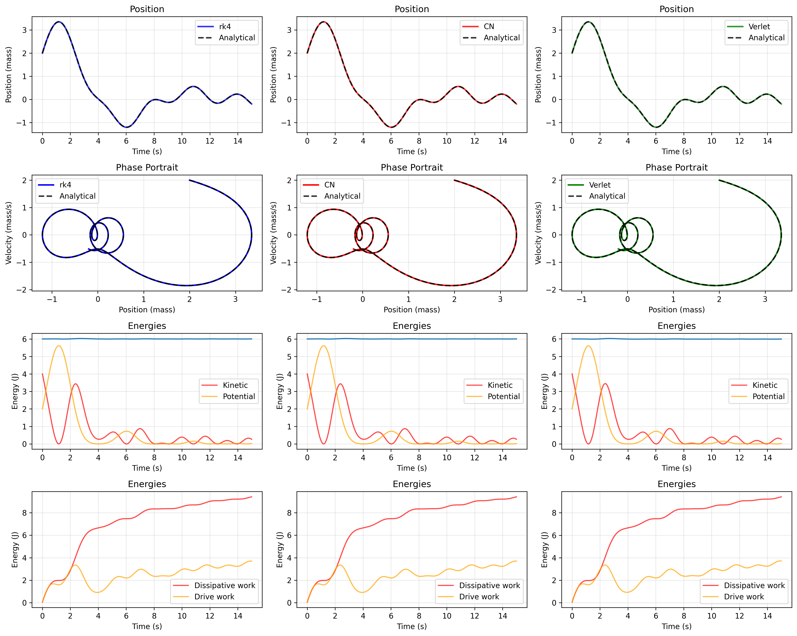
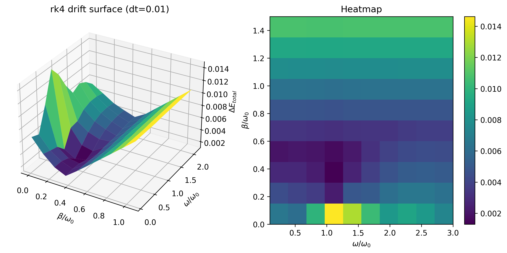
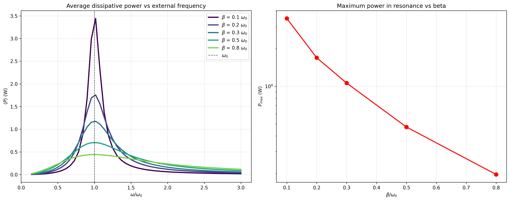
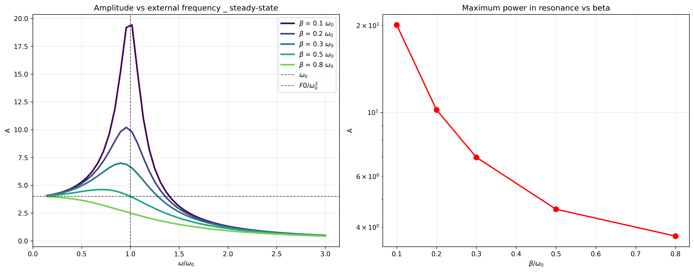

<h1>Linear Driven Oscillation</h1>

In this section we study the <strong>linear driven damped oscillator</strong> under a periodic external force. 
The governing equation is

$$
m \ddot{q} + \gamma \dot{q} + k q = F_0 \cos(\omega t).
$$

To simplify notation, we introduce the standard parameters:

$$
\alpha = \frac{F_0}{m}, 
\qquad 
\beta = \frac{\gamma}{2m}, 
\qquad
\omega_0^2 = \frac{k}{m},
$$

so the equation becomes

$$
\ddot{q} + 2\beta \dot{q} + \omega_0^2 q = \alpha \cos(\omega t).
$$

<h2>General Solution</h2>

This is a second‑order linear non‑homogeneous ODE. Its solution is the sum of:

$$
q(t) = q_{\text{hom}}(t) + q_{\text{part}}(t).
$$
  

<h3>Homogeneous Solution</h3>

The homogeneous equation is

$$
\ddot{q} + 2\beta \dot{q} + \omega_0^2 q = 0.
$$

The characteristic equation

$$
r^2 + 2\beta r + \omega_0^2 = 0
$$

has roots

$$
r = -\beta \pm \sqrt{\beta^2 - \omega_0^2}.
$$

For the <strong>underdamped</strong> case, $\beta < \omega_0$, the solution becomes

$$
q_{\text{hom}}(t) = e^{-\beta t}
\left(A\cos(\omega_d t) + B\sin(\omega_d t)\right),
$$

where the <strong>damped natural frequency</strong> is

$$
\omega_d = \sqrt{\omega_0^2 - \beta^2}.
$$

<h3>Particular (Steady‑State) Solution</h3>

We assume a solution of the form

$$
q_{\text{part}}(t) = A \cos(\omega t - \delta).
$$

Solving for the amplitude and phase lag gives

$$
A = \frac{\alpha}{\sqrt{(\omega_0^2 - \omega^2)^2 + (2\beta\omega)^2}},
$$

$$
\tan\delta = \frac{2\beta\omega}{\omega_0^2 - \omega^2}.
$$

This steady‑state term dominates after transients decay.

<h2>Verlet Method</h2>

As I promise when I start this oscillation folder, in every motion I teach you a new numerical method. To compare this time our known numerical methods, we introduce the <strong>velocity Verlet</strong> integrator, commonly used for conservative systems. Starting from Newton’s law

$$
m\ddot{q} = F(q),
$$

the update equations are

$$
q_{n+1} = q_n + v_n \Delta t + \frac{1}{2} a_n (\Delta t)^2,
$$

$$
a_{n+1} = \frac{F(q_{n+1})}{m},
$$

$$
v_{n+1} = v_n + \frac{1}{2}(a_n + a_{n+1})\Delta t.
$$

Although Verlet is designed for conservative systems, it performs remarkably well in this linear driven case, showing excellent energy behavior as well as RK4 and Crank–Nicolson.

  As we can see, the numerical methods match the analytical solution remarkably well. In particular, the total energy of the system (blue curve in the thrid row) remains essentially constant, demonstrating the excellent stability of the integrators.
  For a deeper analysis of numerical errors, several 3-dimensional heatmaps are included in figures folder. These explore how the energy drift varies when sweeping over different normalized values of $\omega$ and $\beta$, allowing to us to identify regions of stability (far from resonance) and instability (close to resonance) across the parameter space.

  Before discussing resonance, we must understand how energy flows in a non-conservative system. 
  Of course, our mechanical energy is $E_mec = T + U = \frac{1}{2}m dq^2 + \frac{1}{2} k q^2$ - Note: the U's formula depends on potential. However, because of damping and external parameter forcing, the system is not conservative, so $\Delta E_mec \neq 0$.
  
How will we deal with? With the Work-Energy theorem states:

  $$
  \frac{d E_{mec}}{dt} = \sum P_{non-conservative} = P_{drive} - P_{diss},
  $$

As we know, $P = F v$ or $P = F dq$. While dissipative force is $F_{diss}= - \gamma dq$, drive force is $F_{ext} = F_0 cos(\omega t)$. So, $P_{drive} =  F_{ext} dq$ is the instantaneous power injected by the external force, and $P_{diss} = \gamma dq^2$ is the instantaneous power lost to damping.

Integrating over the time gives the work contributions. On the one hand, dissipative energy: $W_{diss} = \int \gamma dq^2\ dt$. On the othen hand, drive energy: $W_{drive}= \int F_{ext} dq\ dt$.
So, the total energy system is: 

  $$
  E = E_{mec} + W_{diss} - W{drive}
  $$

   
<h2>Resonance</h2>

Resonance occurs when the driving frequency ($\omega$) approaches the natural frequency ($\omega_0$) of the system as we can see in the following picture:

In the long‑term, the motion is purely steady‑state because of exponential term:

$$
q_{\text{steady}}(t) = A \cos(\omega t - \delta),
$$

with amplitude:

$$
A = \frac{\alpha}{\sqrt{(\omega_0^2 - \omega^2)^2 + (2\beta\omega)^2}}.
$$

<h3>Near Resonance</h3>

If

$$
4\beta^2 \omega^2 \ll (\omega_0^2 - \omega^2)^2,
$$

and $\omega \approx \omega_0$, the denominator becomes small and the amplitude grows large, producing the classical resonance peak as we have showed in the previous pictures.

Two equivalent ways to observe resonance:

<ol>
  <li>
    Tune the natural frequency $\omega_0$ close to the driving frequency $\omega$:
    
    
    A \approx \frac{F_0}{2\beta\omega_0}.
    
  </li>

  <li>
    Tune the driving frequency $\omega$ close to $\omega_0$ .  
    To find the frequency that maximizes the steady‑state amplitude, we minimize the denominator:
    
    
    D(\omega) = (\omega_0^2 - \omega^2)^2 + (2\beta\omega)^2.
        
    Differentiating and setting \( dD/d\omega = 0 \) gives the resonance condition
    
    
    \omega_{\text{res}} = \sqrt{\omega_0^2 - 2\beta^2}.

        
    Thus the strongest response occurs when the driving frequency is slightly below the natural frequency, with the shift depending on the damping.
  </li>
  
</ol>

Both approaches reveal the characteristic resonance behavior.

