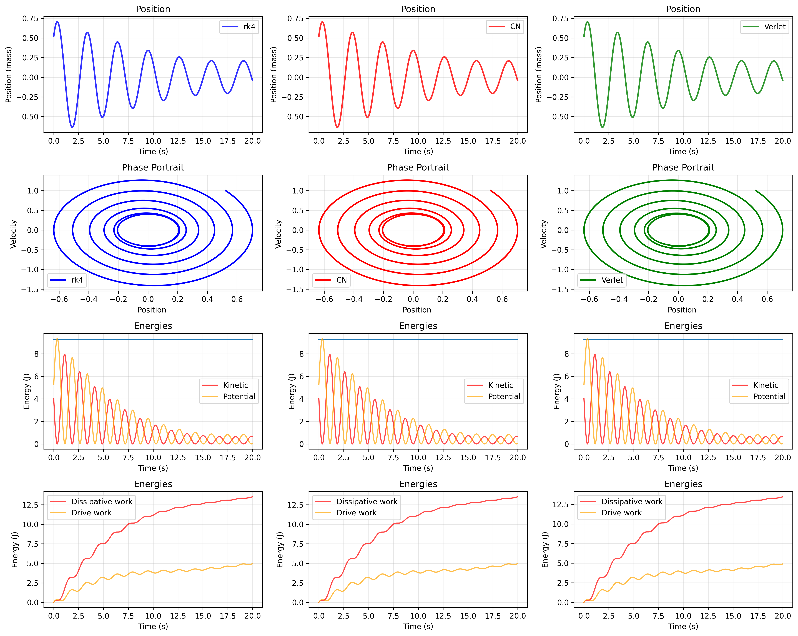
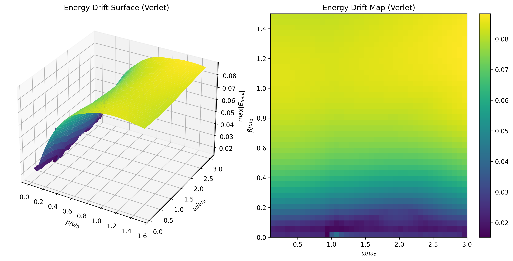
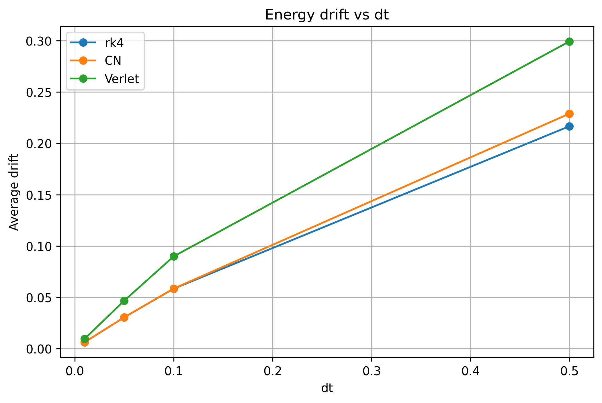
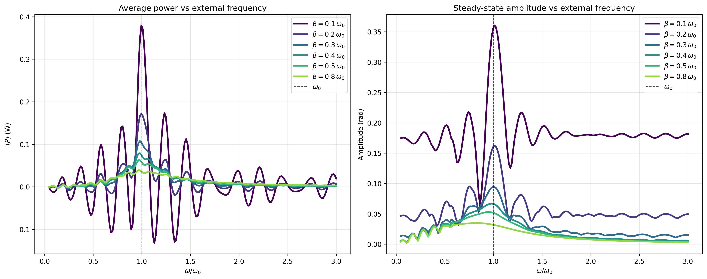
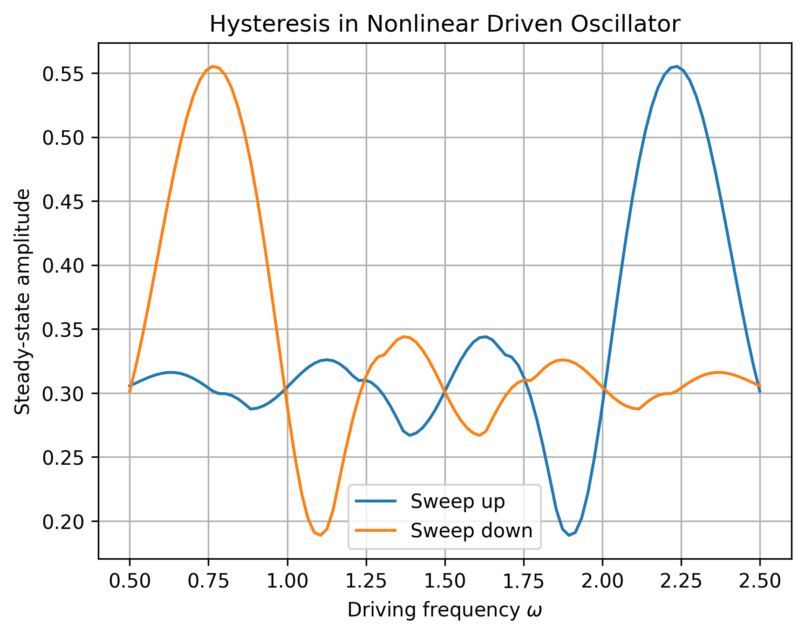
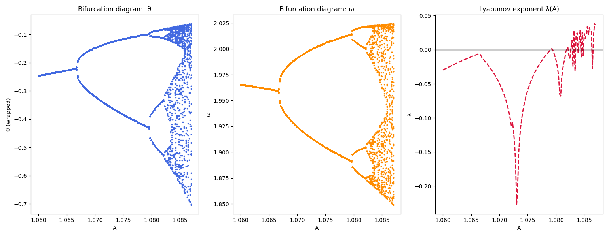
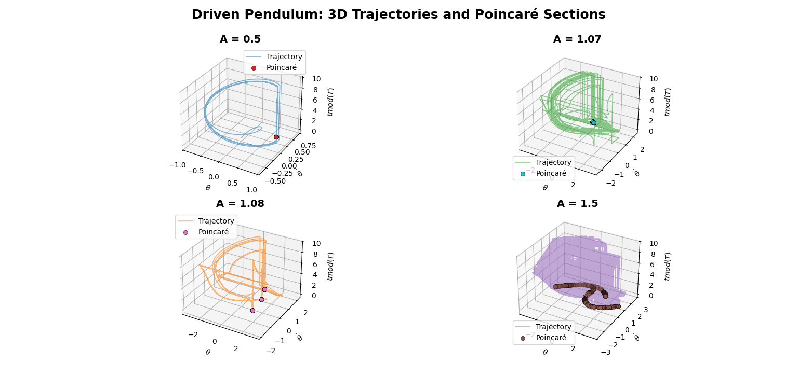

<h1>Nonlinear driven oscillation</h1>

In this section we study the <strong>nonlinear driven damped oscillator</strong> under a periodic external force. 
The governing equation is

$$
m L^2 \ddot{q} + \gamma \dot{q} + m g L sin(q) = F_0 \cos(\omega t).
$$

Each term corresponds to a real phyisical effect:
  <li> $m$ $L^2$ $\ddot{q}$ rotacional inertiaa x angular acceleration.</li>
  <li> $\gamma$ $\dot{q}$ viscous dampeing torque.</li>
  <li> $mgL$ $\sin(q)$- gravitational restoring torque.</li>
  <li> $F_0$ $\cos(\omega t)$ - external periodic driving torque.</li>

To simplify notation, we introduce the standard parameters:

$$
\alpha = \frac{F_0}{m L^2}, 
\qquad 
\beta = \frac{\gamma}{2m L^2}, 
\qquad
\omega_0^2 = \frac{g}{L},
$$

so the equation becomes

$$
\ddot{q} + 2\beta \dot{q} + \omega_0^2 sin(q) = \alpha \cos(\omega t).
$$

  This equation have not analytical solution, so we have to dip into numerical methods: Crank Nicolson (CN), RK4 and Verlet integrator. As we can see, in the previous picture, our numerical method match energy system remarkable well. Also, we ilustrate how the drift energy change with different steps integration or 3-dimensional heatmaps graphics sweeping over normalizes values of $\beta$ and $\omega$.

<h2>Resonance</h2>

What happens if we try to look for resonance in this nonlinear system? Well, the resonance appears as a single smooth peak when $\frac{\omega}{\omega_0} \approx 1$. However, for the nonlinear driven pendulum the situation completey changes. Because the restoring force involves $\sin(q)$ instead of $q$, the system does not respond at a single frequency. Instead, the motion contains many harmonics and subharmonics. As a consequence, when we sweep the driving frequency, the “resonance curve” no longer forms a single clean peak. Instead, we obtain several branches — the exact number and shape depend on the numerical step size and on the initial conditions.

  In other words, the resonance curve breaks into multiple interfering solutions rather than a single smooth one. This interference is a hallmark of nonlinear dynamics and is one of the first signs that the system can behave chaotically.

But we also encounter another curious and important phenomenon in nonlinear driven systems, called <b>hysteresis</b>. Hysteresis appears when the response of the system does not follow a single, unique curve as we vary a parameter (for example, the driving frequency). Instead, the system can “remember” the direction of the sweep. This means that sweeping the frequency upward and sweeping it downward produce <b>different steady-state amplitudes</b>.

  Why does hysteresis appear?
In nonlinear oscillators, the amplitude–frequency relation can develop multiple stable solutions for the same driving frequency. The system can jump from one branch to another depending on its past history. This creates a loop-shaped curve: the hallmark of hysteresis. In the driven pendulum, hysteresis typically appears when:
  
<li>The drive amplitude is strong enough,</li>
<li>Damping is small,</li>
<li>The nonlinearity (the $\sin(q)$ term) becomes significant.</li>

Under these conditions, the resonance curve bends and folds over itself. When we sweep the frequency upward, the system follows one branch; when we sweep downward, it follows another. The result is a characteristic hysteresis loop in the amplitude–frequency diagram.

<h3>Chaotic motion</h3>

Take a look one more time at our precious equation: 

  $$
  \ddot{q} + 2\beta \dot{q} + \omega_0^2 sin(q) = \alpha \cos(\omega t).
  $$

  This is a <b>non-autonomous</b>, where the independent variable t appears explicitly in the forcing term. We can convert it into an <b>autonomous</b> system by introducing additional variables ($\phi = \omega t$) and rewriting it as a system of first-order equations.

  $$
  \begin{cases}
  \dot{q} = u\\
  \dot{u} = - 2\beta \dot{q} - \omega_0^2 sin(q) + \alpha \cos(\omega t)\\
  \dot{\phi} = \omega
  \end{cases}
  $$

  Now the system is autonomous: the right-hand sides depend only on the variables ($q$, $u$, $\phi$).   At the same time, it still encodes the original driven, damped pendulum dynamics.
  
  The necessary conditions for an autonomous system of differential equations to admit chaotic solutions are:
<ol>
<li>The system must have at least three independent dynamical variables — <i>condition satisfied</i>.</li>
<li>The system must contain at least one nonlinear coupling — <i>condition satisfied</i>.</li>
</ol>

But, what exactly is chaos? To be precise, what we are studying here is called deterministic chaos: chaotic behaviour arising from deterministic equations of motion. What we will named as chaos is: small changes in the initial conditions lead to exponentially diverging in trajectories. This sensitivity to initial condition is often called: <b>Butterfly effect</b>.

How can we illustrate chaos in a dynamical system?

<li>Bifurcation diagram: A plot showing how the long‑term behavior of the system changes as a parameter varies.
Period‑doubling cascades, windows of stability, and sudden transitions reveal the route to chaos</li>
<li>Lyapunov exponent: A quantitative measure of sensitivity to initial conditions.
A positive Lyapunov exponent indicates exponential divergence of nearby trajectories — the hallmark of chaos.</li>

<li>Poincare sections:A stroboscopic “slice” of the phase space.
Regular motion produces smooth curves; chaotic motion fills regions irregularly, revealing the underlying structure of the attractor.</li>

Note: these three graphics have an animation in the first readme.md. Moreover, a further explanation will be soon.

<h4>Bibliography</h4>

The following resources were consulted during the preparation of this section:

<a>https://math.libretexts.org/Bookshelves/Scientific_Computing_Simulations_and_Modeling/Scientific_Computing_(Chasnov)/II%3A_Dynamical_Systems_and_Chaos/11%3A_The_Damped%2C_Driven_Pendulum </a>

<a>https://www.researchgate.net/publication/321511263_Resonance_oscillation_of_a_damped_driven_simple_pendulum </a>

<a> https://openlearninglibrary.mit.edu/courses/course-v1:MITx+8.03x+1T2020/courseware/week:week2/seq-lect_04b/?activate_block_id=block-v1%3AMITx%2B8.03x%2B1T2020%2Btype%40sequential%2Bblock%40seq-lect_04b </a>

Class notebooks and lecture notes.
