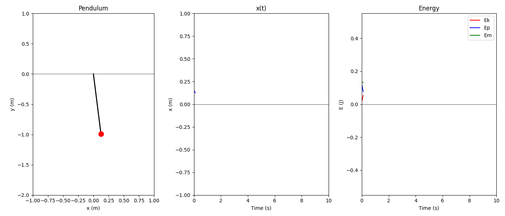
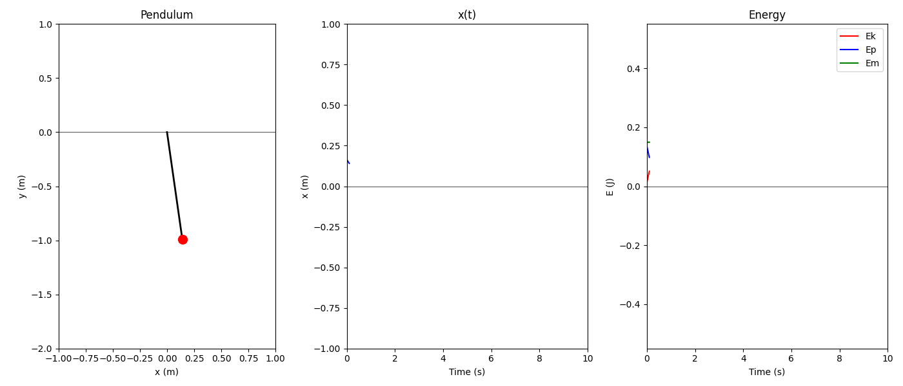
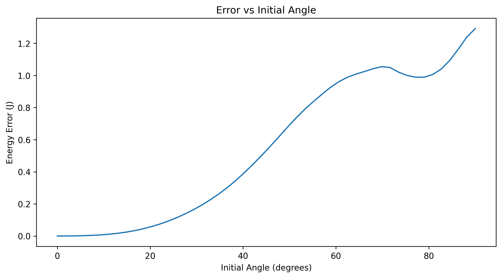
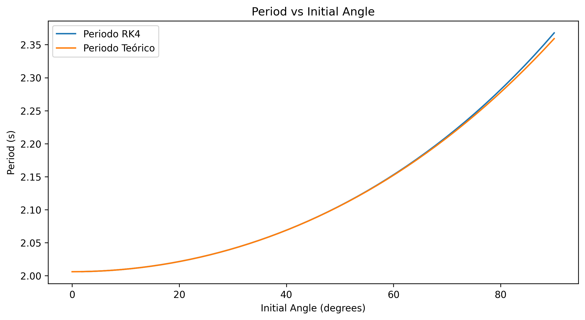
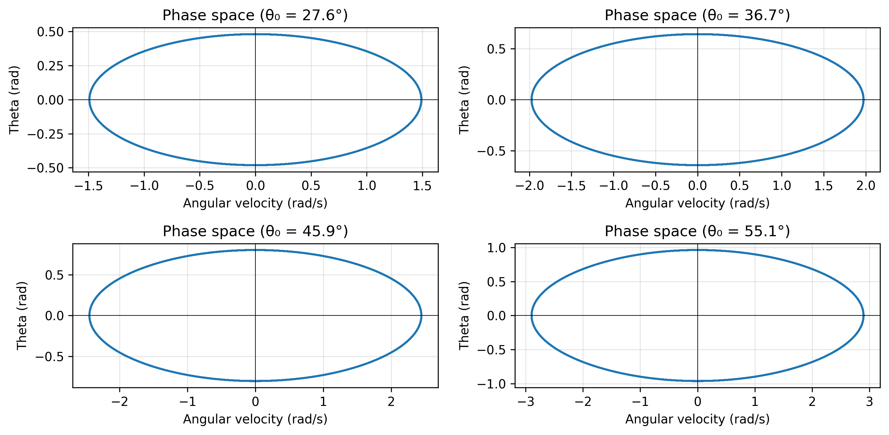
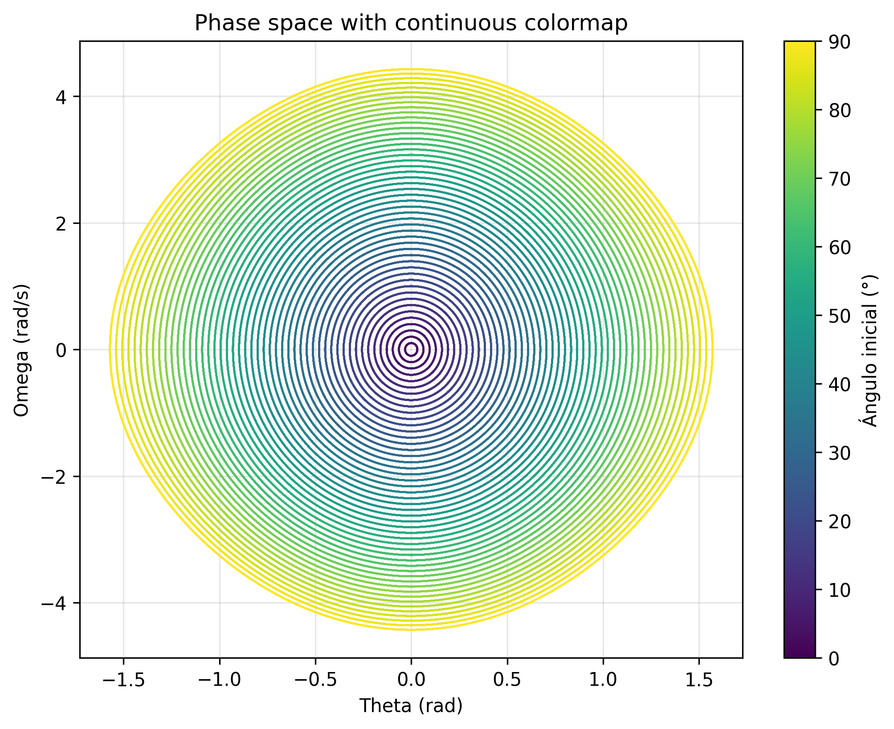
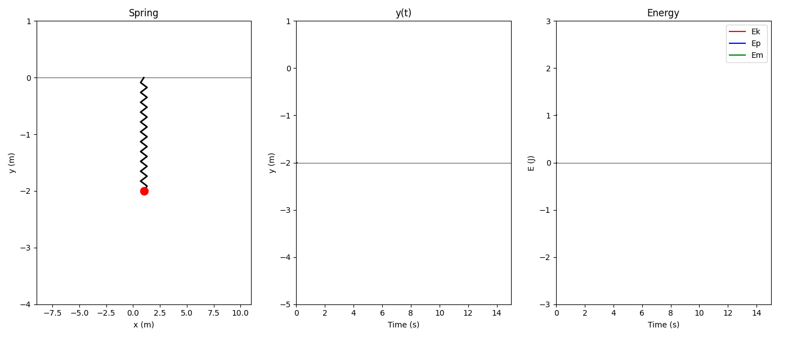
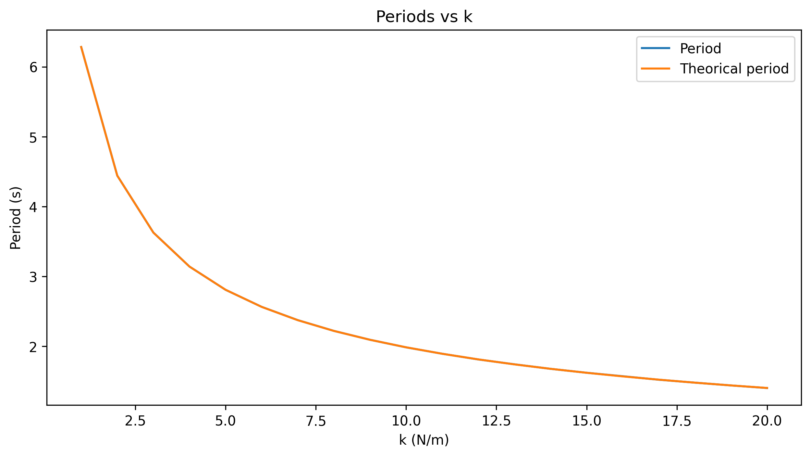
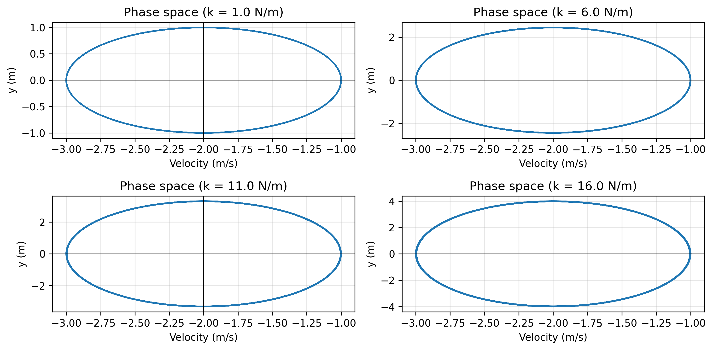

<h1>Simple Harmonic Motion (SHM) — Numerical Exploration</h1>

Hi, how is it going on?

This repository is the <strong>first part of a three‑part series</strong> dedicated to understanding oscillatory motion.
Oscillations appear everywhere: from the periodic sway of a leaf to the vibrations inside machines.
But how can we <em>describe</em> this kind of motion?

<h2>📌 1. The Differential Equation of SHM</h2>

A system undergoing simple harmonic motion satisfies the linear second‑order differential equation:

$$
\frac{d^2x}{dt^2} + \omega^2 x = 0
$$

whose analytical solution is:

$$
x(t) = A \cos(\omega t + \phi)
$$

This equation describes, for example:

<ul>
  <li>A <strong>1‑D mass–spring system</strong></li>
  <li>A <strong>pendulum under the small‑angle approximation</strong> $(\sin\theta \approx \theta)$</li>
</ul>

<h2>📌 2. The Real Pendulum Equation</h2>
4

The exact equation of motion for a pendulum of length $L$ is:

$$
\frac{d^2\theta}{dt^2} + \frac{g}{L}\sin\theta = 0
$$

This equation is <strong>non‑linear</strong>, and therefore <strong>has no closed‑form analytical solution</strong> in elementary functions.

<h2>📌 3. Numerical Methods: Euler vs. Runge–Kutta</h2>

Euler’s method initially seems to work, but when you compute the <strong>mechanical energy</strong>, you will notice that the motion is <em>not</em> conservative.

This happens because:

<ul>
  <li>Euler’s method accumulates error at every step.</li>
  <li>For oscillatory systems, this accumulated error grows without bound.</li>
</ul>

A better alternative is the <strong>Runge–Kutta 4th order method (RK4)</strong>, which conserves energy much more accurately.

<h2>📌 4. Repository Structure</h2>

This repository contains two main classes:

<ul>
  <li><strong>Pendulum</strong></li>
  <li><strong>Spring</strong></li>
</ul>

<h2>📌 5. Pendulum Class</h2>

The <code>Pendulum</code> class can generate a <strong>2‑dimensional animation</strong> when <code>animate=True</code>.

<ul>
  <li>If <code>approx=True</code>, it uses the <strong>small‑angle approximation</strong>.</li>
  <li>If <code>approx=False</code>, it solves the <strong>non‑linear equation</strong> using <strong>RK4</strong>.</li>
</ul>

<h3>🔹 Small‑angle approximation animation</h3>

<h3>🔹 Full non‑linear pendulum animation</h3>

<h2>📌 6. When Does the Approximation Fail?</h2>

The following figure compares the <strong>energy error</strong> between the approximate and exact models:

Comparison of the <strong>period</strong> as a function of the initial angle:

<h2>📌 7. Phase Space Representation</h2>

Phase space provides a powerful way to visualize the dynamics of oscillatory systems.

A colormap of trajectories as a function of the initial angle:

For small angles, the trajectory is nearly circular.
For large angles, the trajectory becomes elliptical due to the non‑linear term.

<h2>📌 8. Spring Class</h2>

The <code>Spring</code> class models a <strong>1‑D mass–spring system</strong> located at \((x_0, y_0)\).
It computes:

<ul>
  <li>Position</li>
  <li>Velocity</li>
  <li>Mechanical energy</li>
  <li>Phase space trajectory</li>
</ul>

and can animate the motion:

<h2>📌 9. Influence of the Spring Constant \(k\)</h2>

The period of a mass–spring system is:

$$
T = 2\pi\sqrt{\frac{m}{k}}
$$

Thus, increasing \(k\) <strong>reduces the period</strong>, as shown here:

The phase space also changes with \(k\):

As \(k\) increases:

<ul>
  <li>The system oscillates faster.</li>
  <li>The phase‑space ellipse becomes <strong>narrower in position</strong> and <strong>wider in velocity</strong>.</li>
</ul>

<h2>📌 10. What’s Next?</h2>

This is only the beginning.
In the next part, we will explore:

<ul>
  <li><strong>Damped oscillations</strong></li>
  <li><strong>Driven oscillations</strong></li>
  <li><strong>Resonance</strong></li>
  <li><strong>Energy dissipation</strong></li>
</ul>

Stay tuned!

