## Double pendulum: A gateway to chaos

The double pendulum is a classic example of nonlinear, chaotic system. Despite its simple structure - two masses connected by rigid rods - it exhibits highly sensitive dependence on initial conditions, making long-term prediction nearly impossible without precise computation.

- **Lagrangian formulation:**
  
 As always, identifying the system's degrees of freedom (the angular coordinates $\theta_1$ and $\theta_2$), we derive the equations of motion using the Euler-Lagrangeequations.

  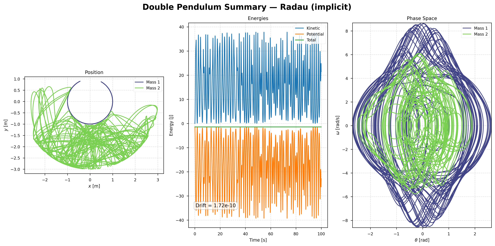 

The results is a set of coupled, nonlinear, second-order differential equations that cannot be solved analytically in general.

- **For the first pendulum:**

$$
\ddot{\theta}_1 =
\frac{-g(2m_1 + m_2)\sin\theta_1 - m_2 g \sin(\theta_1 - 2\theta_2) - 2\sin(\theta_1 - \theta_2)\,m_2\left(\dot{\theta}_2^{\,2} l_2 + \dot{\theta}_1^{\,2} l_1 \cos(\theta_1 - \theta_2)\right)}{ l_1\left(2m_1 + m_2 - m_2\cos(2\theta_1 - 2\theta_2)\right)}
$$

- **For the second pendulum:**

$$
\ddot{\theta}_2 =
\frac{2\sin(\theta_1 - \theta_2)\left(\dot{\theta}_1^{\,2} l_1 (m_1 + m_2)+ g (m_1 + m_2)\cos\theta_1 + \dot{\theta}_2^{\,2} l_2 m_2 \cos(\theta_1 - \theta_2) \right)}{l_2\left(2m_1 + m_2 - m_2\cos(2\theta_1 - 2\theta_2)\right)}
$$

These equations describe the full nonlinear dynamics of the system, and are typically solved using numerical methods.
There also exists a way to simplify these equations. Using the small-angle approximation, same masses, and same length. We can transform the nonlinear equation to a couple of:

- **Small-angle approximation,  $m_1 = m_2 = m$; $l_1 = l_2 = l$**

$$
\ddot{\theta}_1 \approx -\frac{g}{l}\left(3\theta_1 - 2\theta_2\right)
$$

$$
\ddot{\theta}_2 \approx \frac{2g}{l}\left(\theta_1 - \theta_2\right)
$$

  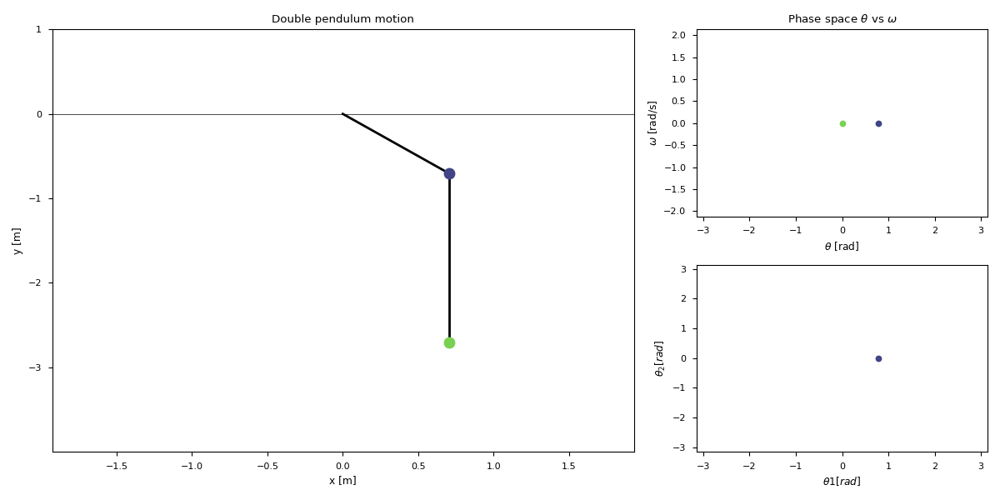

## How do we write it?
Firstly, we have to calculate the kinetic energy to get the mass matrix - a matrix that captures the inertia of the system and mathematically describes how mass is distributed across the moving parts:

$$
T = \tfrac12\ \dot{\boldsymbol{\theta}}^{\mathsf{T}} \mathbf{M}(\theta_1,\theta_2)\ \dot{\boldsymbol{\theta}}
$$

For the double pendulum:

$$
T = \tfrac12 (m_1+m_2) L_1^2 \dot{\theta}_1^2 + \tfrac12 m_2 L_2^2 \dot{\theta}_2^2 + m_2 L_1 L_2 \dot{\theta}_1 \dot{\theta}_2 \cos(\theta_1 - \theta_2)
$$

 This yields the mass matrix:
 
$$
\mathbf{M}(\theta_1,\theta_2) = \begin{pmatrix} (m_1+m_2)L_1^2 & m_2 L_1 L_2 \cos(\theta_1 - \theta_2) \\
m_2 L_1 L_2 \cos(\theta_1 - \theta_2) & m_2 L_2^2
\end{pmatrix}
$$

Secondly, we calculate, from the Lagrangian, the force vector - where each component is the generalized force conjugate to the generalized coordinate $\theta_i$:

$$
\mathbf{Q} = -\frac{\partial V}{\partial \boldsymbol{\theta}}                        + \text{Coriolis/Centrifugal terms from } \frac{d}{dt} \left( \frac{\partial T}{\partial \dot{\boldsymbol{\theta}}} \right)
$$

Potential energy:

$$
V = -(m_1+m_2) g L_1 \cos\theta_1 - m_2 g L_2 \cos\theta_2
$$

The vector Q is the generalized force vector. It contains all gravitacional terms, centrifugal, and coriolis terms that arise from the Langrangian. 
It represents all contributions to the dynamics that do not multiply the accelations. 

$$
\mathbf{Q}(\theta_1,\theta_2,\dot{\theta}_1,\dot{\theta}_2) = \begin{pmatrix}
-(m_1+m_2)gL_1 \sin\theta_1 - m_2 L_1 L_2 \dot{\theta}_2^{\,2} \sin(\theta_1 - \theta_2) \\
m_2 L_1 L_2 \dot{\theta}_1^{\,2} \sin(\theta_1 - \theta_2) - m_2 g L_2 \sin\theta_2 
\end{pmatrix}
$$

Full nonlinear dynamics:

$$
\mathbf{M}(\theta_1 \theta_2)\,\boldsymbol{\alpha} = \mathbf{Q}
$$

Therefore:

$$
\boldsymbol{\alpha} = \mathbf{M}^{-1} \mathbf{Q}
$$

In numerical simulations, this is solved at each timestep using a linear solver.

$$
\begin{pmatrix}
\ddot{\theta}_1 \[4pt] \ddot{\theta}_2\end{pmatrix} =
\mathbf{M}(\theta_1,\theta_2)^{-1}\
\mathbf{Q}(\theta_1,\theta_2,\dot{\theta}_1,\dot{\theta}_2)
$$

Note: do not worry if you do not get it at first. It took me a few weeks understand this nomenclature and why it works. As a comment, the standard manipulator equation is:

$$
M(\theta) \ddot{\theta} + C(\theta, dot{\theta}) \dot{\theta} + G(\theta) = F
$$

It is usually used in robotics and multibody dynamics.

## Numerical methods

In this chapter, we will not use the classical numerical methods introduced earlier in this series
RK4, Verlet, Crank--Nicolson, Euler.  
Instead, we focus on the *pythonic* numerical integrators provided by the
*scipy.integrate.solve_ivp* library.

The methods we will study are:

- RK45 (explicit, adaptive).
- RADAU (implicit, stiff).
- DOP853 (explicit, high order).
- BDF (implicit, stiff).

Before comparing how these methods perform, we recall that all of them are based on the general
Runge-Kutta (RK) framework.  
So, what is a Runge-Kutta method, and why does it work?

Runge-Kutta methods are a family of explicit and implicit iterative schemes for solving
initial-value problems using a temporal discretization.  
Within this family, the most widely known method is the classical fourth-order method (RK4),
appreciated for its simplicity and robustness.

Explicit RK methods compute the next value $y_{n+1}$ using a weighted average of several
intermediate slopes $k_i$:

$$
    y_{n+1} = y_n + h \sum_{i=1}^{s} b_i k_i 
$$

where each slope is defined by

$$ 
\begin{aligned}
  k_1 = f(t_n, y_n),\\
  k_2 = f(t_n + c_2 h, y_n + (a_{21} k_1) h),\\
  .\\
  .\\
  .\\
  k_s = f(t_n + c_s h, y_n + (a_{s1} k_1 + a_{s2} k_2 + ... + a_{s, s-1} k_{s-1}) h)
  \end{aligned}
$$

The coefficients $a_{ij}, b_i, c_i$ form the Butcher tableau, which characterizes the method.

Implicit RK methods are typically used for stiff problems.  
Their structure is similar, but the slopes satisfy

$$
  k_i = f\left(t_n + c_i h,\;
  y_n + h \sum_{j=1}^{s} a_{ij} k_j \right),
$$

which requires solving a system of algebraic equations at every step.  
This increases the computational cost but greatly improves stability.

With the basic RK ideas introduced, we now examine how the Pythonic solvers perform:

- **RK45 (Runge--Kutta--Fehlberg 5(4))**: RK45 is an explicit adaptive Runge--Kutta method based on an embedded pair of orders $5$ and $4$.  
The solver computes two approximations, and uses their difference to estimate the local truncation error. 

$$
    y_{n+1}^{(5)}, \qquad \hat{y}_{n+1}^{(4)},  
$$

  The accepted value is the fifth-order solution, while the fourth-order estimate controls the       step size. This method is efficient for non-stiff problems and is the default choice in
  *solve_ivp*.

- **RADAU (Implicit Runge-Kutta, Order 5)**: is an implicit Runge-Kutta method of Radau IIA type. It is A-stable and L-stable, making it particularly suitable for stiff systems. The method requires solving a nonlinear system at each step, but its strong stability properties allow much larger time steps than explicit methods.
RADAU is recommended when the dynamics exhibit rapid decay, stiffness, or strongly dissipative behavior.

- **DOP853 (Explicit Runge-Kutta, Order 8)**: is a high-order explicit Runge--Kutta method of order $8$ with embedded error estimators of orders $7$ and $5$.  
It is designed for high-accuracy integration of smooth, non-stiff problems. Although it uses many stages, its adaptive step-size control makes it extremely efficient when high precision is required.   For chaotic systems such as *the double pendulum*, DOP853 often provides the best
balance between accuracy and performance.

- **BDF (Backward Differentiation Formula)**: The BDF method is a multistep implicit scheme of variable order (up to order 5). It is well suited for stiff problems and is widely used in chemical kinetics,
reaction--diffusion systems, and dissipative mechanical models.  
At each step, BDF solves an implicit equation of the form

$$
\alpha_0 y_{n+1} = \sum_{j=1}^{k} \alpha_j y_{n+1-j} + h\,\beta\, f(t_{n+1}, y_{n+1}),
$$

where the coefficients $\alpha_j$ and $\beta$ depend on the selected order $k$.
Because it is multistep, BDF is very efficient for long-time integration of
stiff systems.
  
To get some information: https://docs.scipy.org/doc/scipy/reference/generated/scipy.integrate.solve_ivp.html#r179348322575-1

## Errors and analysis
Now that we have introduced the numerical methods, we can discuss which method is better performs better, or which one requires the least runtime, and how stable each method is under different conditions.

*Note*: all simulations were computed using the parameters: $t_{max} = 150$, $ratol = 1e-10$, $atol = 1e-12$, $m_1 = m_2 = 1.0$, $L_1 = 1.0$, $L_2 = 2.0$. However, in some error graphics we have to short the axes due to clarity.
In some plots, the axes are shortened for clarity.
For each comparison, the left figure corresponds to the linearized equation, and the right figure corresponds to the full nonlinear equation.

- **Runtime:**

  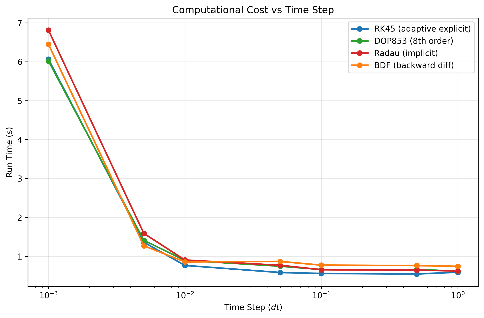
  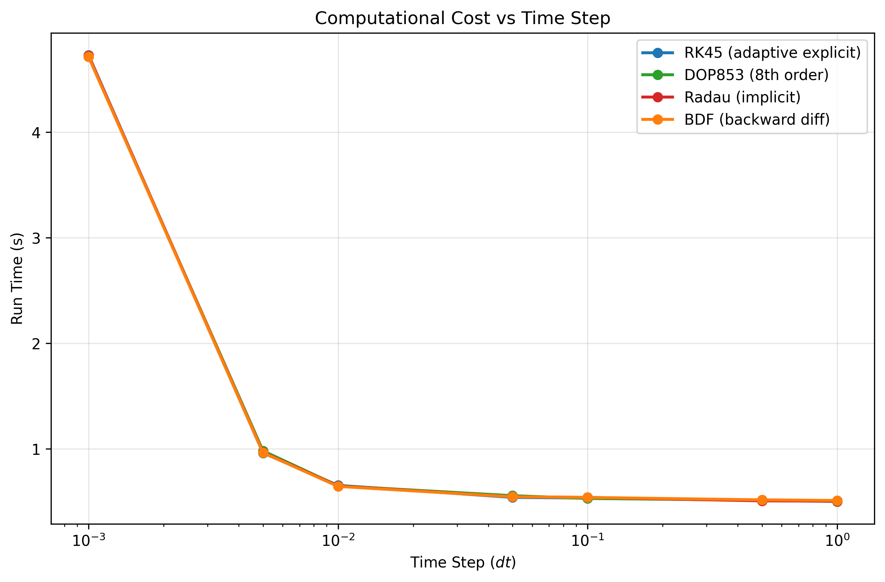

- **Drift energy**

    - Through different timestep:

    

      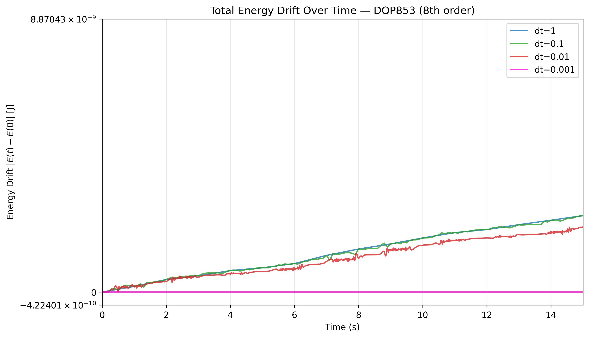
      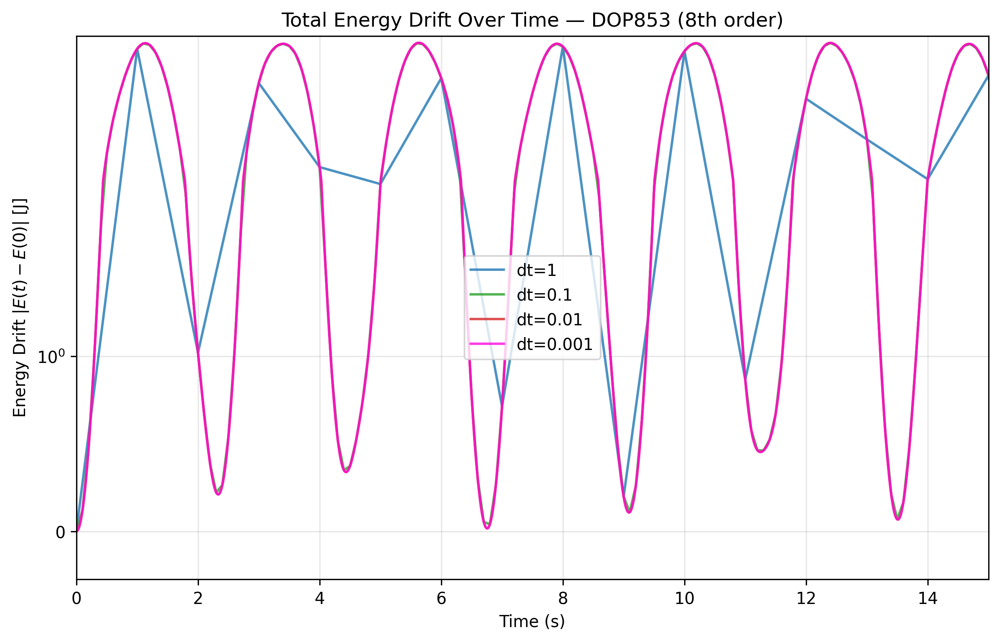
    

    - Through different method:
      
    

      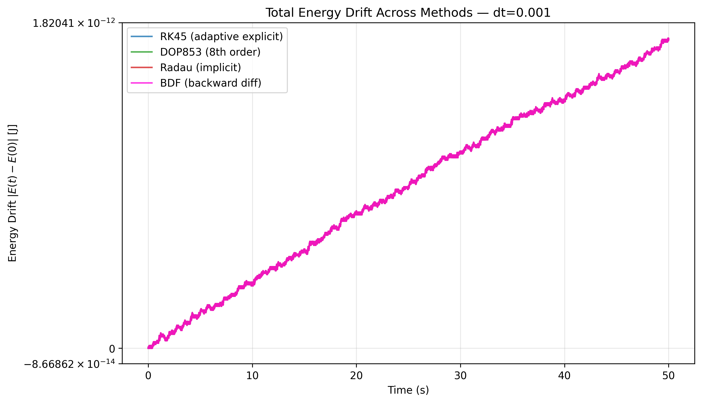
      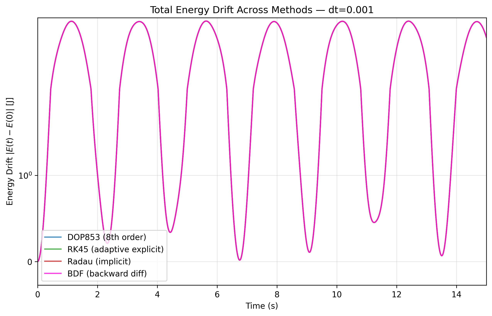
    

    - Through different angle:
  
      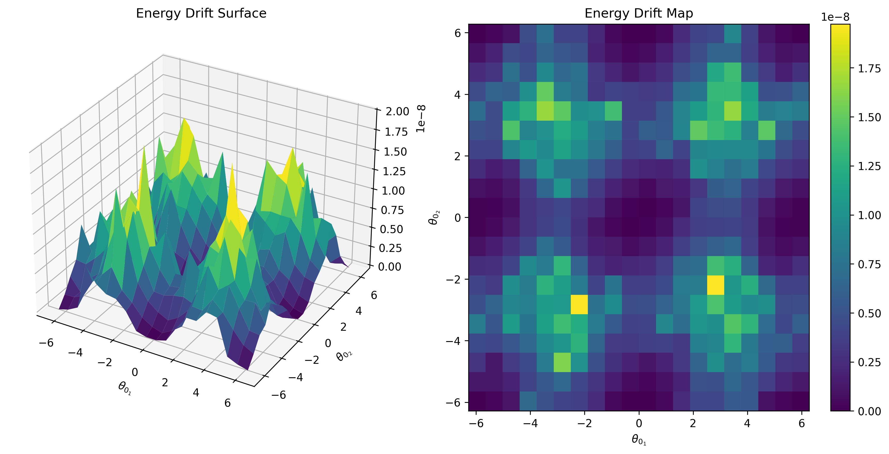

- **Convergence and stability**

  

      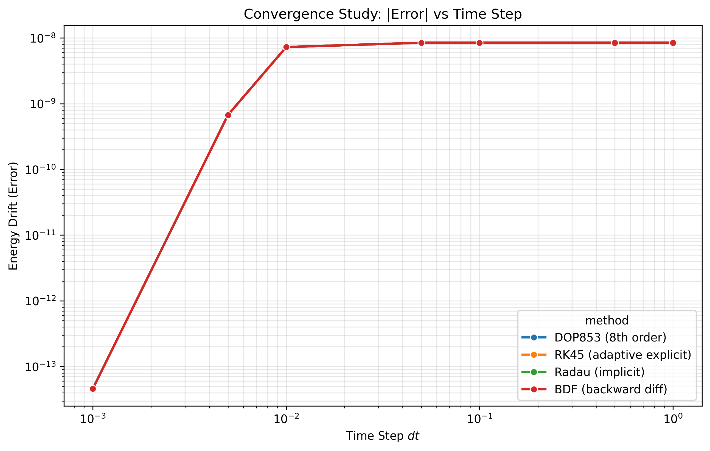
      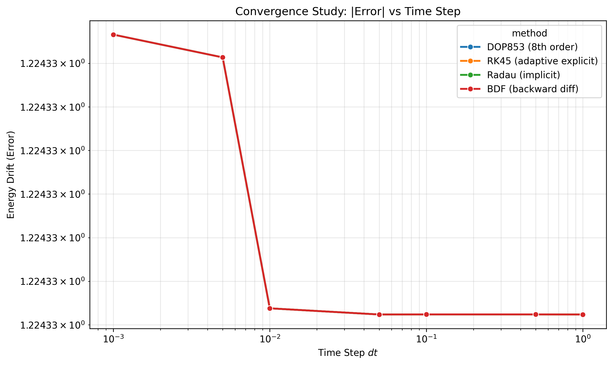
    

  

      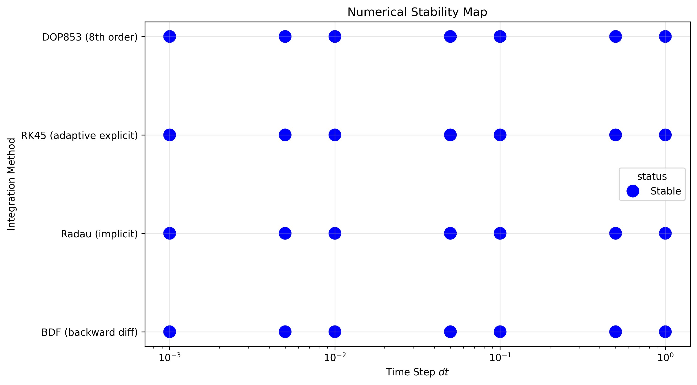
      
    

If you want to explore additional behaviour not shown here, feel free to inspect the code and change a few lines to discover your concerns.

## When physics becomes art

In the previous section, you have seen which numerical methods perform better than others: which ones are slower, which ones struggle to convergence. For this reason, I chose the DOP853 (Explicit) method. It is not only robust and stable, but it also offers a good runtime. 

This section may look a bit a magic treak. When I say that physics becomes art, I am talking about **Fractals**.
A fractal? In the double-pendulum equations? Yes. Fractals appears in many extraordinary contexts: natural patterns (like flowers), chaotic motion, and many others places that you would not expect. By playing with some variables, and tweaking the inial conditions, you can obtain something like this:

  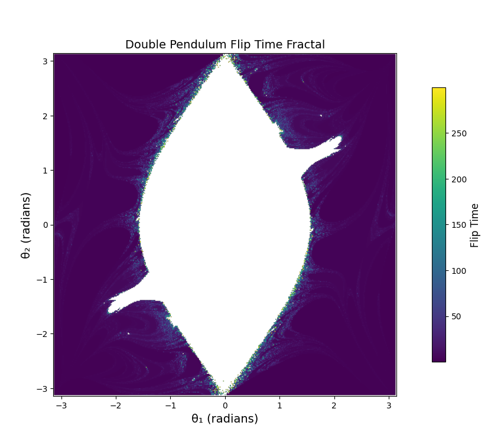 
  <em>Fractal flip-time map of the double pendulum.</em>

This picture (it feels weird to call it graphics), represents the time the double-pendulum takes to perfomr a flip (i.e, when either, $\theta_1 = \pi$ or $\theta_2 = \pi$) as a function of different initial condition.

Talking about fractals, we cannot skip the idea of **fractal dimensionality**. What does that mean? How can we calculate it? Well, this both question and much more, will be answered soon in a dedicated fractal repository. 
In the meantime, I fervently recommend you some fractal galleries on the Internet - some are awesome, others less so, let us say, but all of them are fascinating in their own way.
However, if you really enjoy mathematics and physics, take a look at the bibliography and let yourself be suprised how beautiful this world can be.

# Bibliography

https://dn760009.eu.archive.org/0/items/GOLDSTEINClassicalMechanics/GOLDSTEIN%20%28Classical%20Mechanics%29_text.pdf

https://pythonnumericalmethods.studentorg.berkeley.edu/notebooks/chapter22.01-ODE-Initial-Value-Problem-Statement.html

https://pythonnumericalmethods.studentorg.berkeley.edu/notebooks/chapter10.05-Debugging.html

https://maths.cnam.fr/IMG/pdf/RungeKuttaFehlbergProof.pdf
