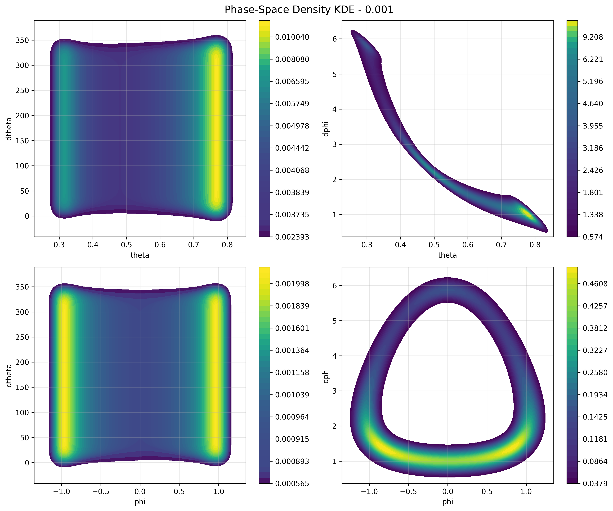
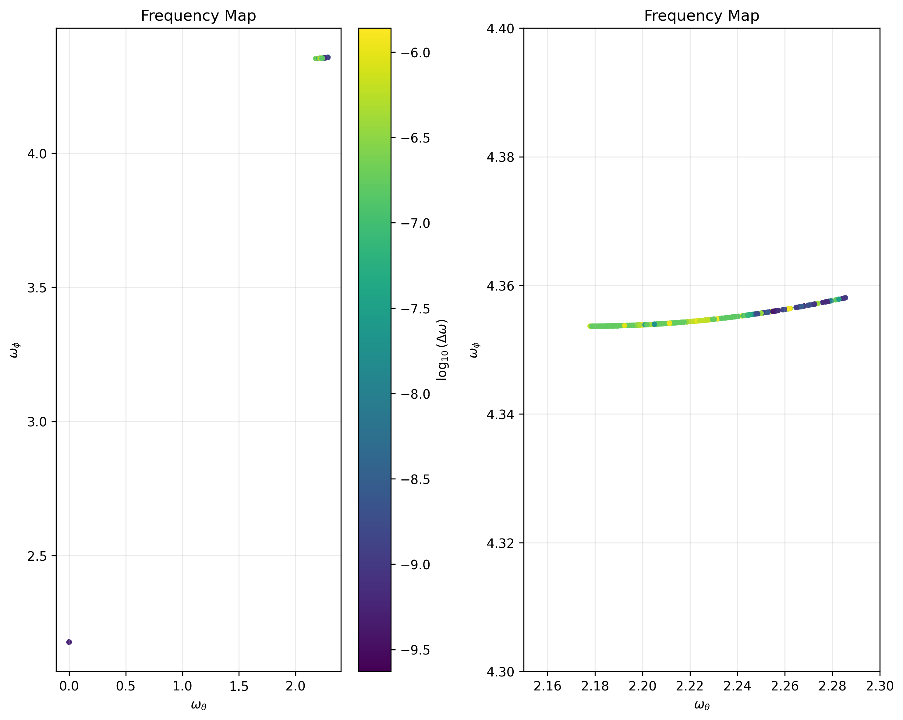
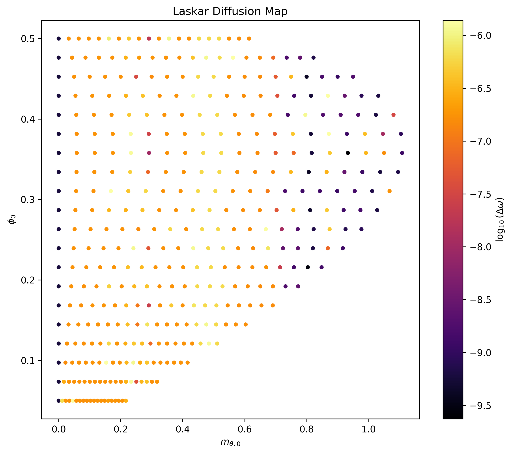
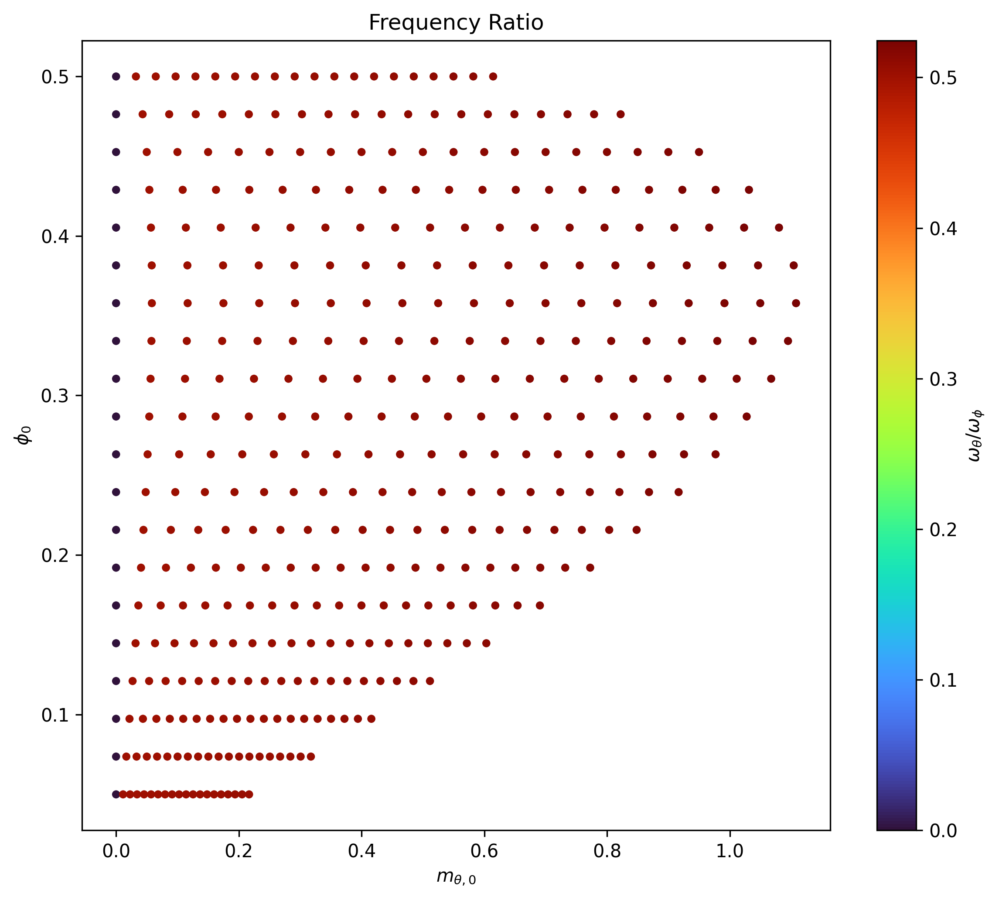
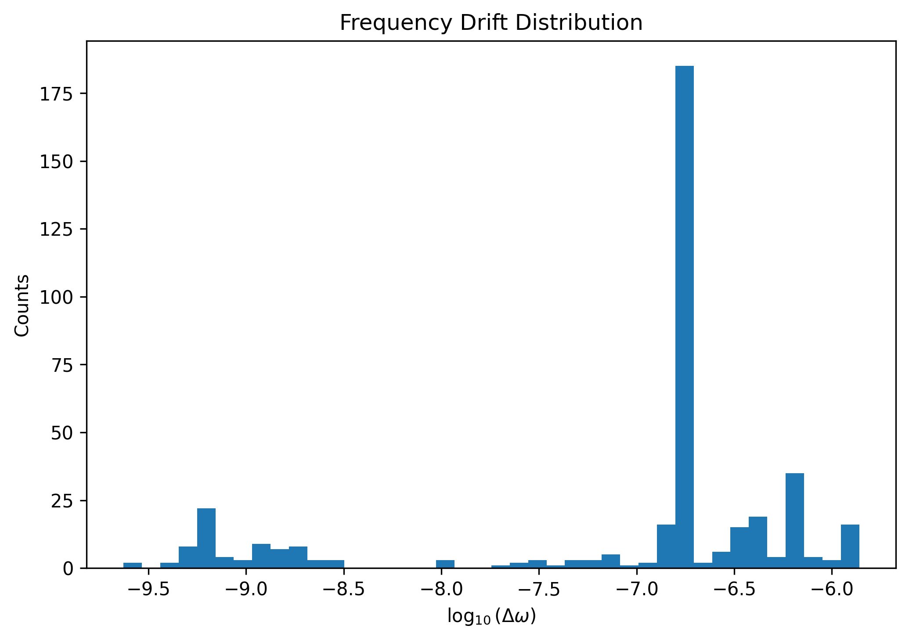

## Spherical pendulum: spinning around and around

Another classical example of special oscillaroty motion is the spherical pendulum. Why is it? Because we live in a three dimensional world. However, this motion still reprensents a two-degree-of-freedom system.

# Lagrangian formulation:

As always, identifying the system's degree of freedom (in this case angular coordenate $\theta$ (polar angle) and $\phi$ (axial angle)), we can derive the equation of motion using the Euler-Langrangian equations:

   

*Note*: the red unit vector is the $u_{\theta}$.

$$
\ddot{\phi} = -\frac{2  \dot{\theta}  \dot{\phi}}{tan{\theta}}
$$

this equation describes how the axial angle change through time. But, if we look at it with good ayes, we discover a critical point. When is the denominator equal to zero? When the angles is $-\frac{\pi}{2}$ or $\frac{\pi}{2}$. So, when it comes to happen, we have to jump it this issue with an interpolation.

$$
\ddot{\theta} = \frac{\dot{\phi}^2  sin(2  \theta)}{2} - \frac{g}{L} sin(\theta)
$$

These equations describe the motion of the spherical pendulum.

A curious description of this system is about angular momentum conservation. The first equation can be written through Euler-Lagrangian equation:

$$
\frac{\partial}{\partial{t}} \left(mL^2 sin(\theta)^2 \dot{\phi}\right) = 0
$$

through this equation we can describe the effective potential like:

$$
mL^2 sin(\theta) ^2 \dot{\phi} = J_z
$$

then:

$$
\dot{\phi} = \frac{J_z}{mL^2 sin(\theta)}
$$

and the second equation it reads as:

$$
\ddot{\theta} = \frac{J_z  cos(\theta)}{m^2 L^4 sin(\theta)^3} - \frac{g}{L} sin(\theta)
$$

These equations describe the full nonlinear dynamics of the system, and are typically solved using numerical methods.

There also exists a way to simplify these equations. Using the small-angle approximation, same masses, and same length. We can transform the nonlinear equation to a couple of:

$$
\ddot{\theta} = \frac{\dot{\phi}^2 2 \theta}{2} - \frac{g}{L} \theta
$$

$$
\ddot{\phi} = {-2 \dot{\theta} \dot{\phi}}{\theta}
$$

   

## Numerical methods:

In this chapter (as always) we have to use numerical methods (or a piece of paper and hundreds of hour) to solve the system. In this case, we use: RK45, DOP853 and, our fantastic and extraordinary method, RK4. 

I wanted to bring this RK4 method back to show how badly works in different angles and with different scales. In this way, I want to remind that the 4th Runge-Kutta method could be used in some cases with good results, but when physic goes hard the method becomes inadequate.

 
  
  
  

## Errors and analysis:
Now we have introduced the numerical methods, and which one is better than the other. We can wonder how well it perfoms.

*Note*: The graphics have been computed with these parameters: $t_max = 150$, ratol = 1e-10, atol = 1e-12, $m = 1.0$ $L = 2.0$ and $dt =0.01$. However, in some error graphics we have to short the axes due to clarity.
For clarity in the right side we display the linearized equation, while in the left side display the normal equation.

 
  
  

If we want a intersection plane:

 
  
  

As we can see in the linearized graphics, the linearized equations *explode* when inital condition becomes bigger than twenty degrees or less. 

Once we discover when the method lose energy, and how it works through different initial conditions, we can talk about two underlying motion: nutation and precession. 

**Nutation:** rocking, swaying, or nodding motion in the axis of rotation of an object, such as gyroscope.

**Precession:** continuous change in the orientation of a rotating body's axis

These two motions probabibly sound familiar, due to the fact that these motions, with others, describes the Earth's movement. The energy is exchanged between *rocking* and *rotation*.

The spherical pendulum is a combination of: 
- Oscillatory motion in $\theta$ (go up and down, nutation)
- Rotation motion in $\phi$ (spinning aroung the z-axis, precession)

The conserved angular momentum creates the precession through this equation:

$$
mL^2 sin(\theta) ^2 \dot{\phi} = J_z
$$

We can see how if $\theta$ decreases then $\dot{\phi}$ increases;conversely, if $\theta$ increases then $\dot{\phi}$ decreases. So, the angular velocity depends on inclination of the pendulum. In the first figure we can clearly see how, as the angle $\theta$ decreases, the trajectory in the phace space becomes narrow and speeds up.

 
  
  

Futhermore, the second equation creates the nutation:

$$
\ddot{\theta} = \frac{J_z  cos(\theta)}{m^2 L^4 sin(\theta)^3} - \frac{g}{L} sin(\theta)
$$

This equation have two terms. The first one is called centrifugal - it pushes outward. While the second one is called gravitational - it pushes downward. In the second picture, the nutation can be appreciated when $\theta$ oscillates while the angle $\phi$ increases in a linear way with some variation.

The thrid figure indicates a continuous probabiliy distribution, where - at the same time as in second figure - the closed curves indicate nutation (modulating the amplitude) and the pattern repetition indicates the precession (modulating the phase). Also, in this figure we can appreciate diffetent densities - places where the pendulum takes a long time - that it coincide with maximus of nutation and slow preccesion.

  

   

## Laskar's map

The last section is about frequency map analysis. In a few words, the FMA is a numerical method based on refined Fourier techniques which porovides a clear representation of the global dynamics of many multi-dimensional system, which is particulary adapted for systems of 3-degrees of freedom and more.
In the main code called: frequency_map.py every single function is explained with its performs. However, firstly, we have to introduce the Hamiltonian mechanics.

These kind of graphics work better with conjugate momenta defined as: $p_j = \frac{\partial L}{\partial \dot{q_j}}$. This definition allows for the extension of the concept of momentum beyond linear and angular momentum to include other types of motion, such as rotational motion or motion in a potential field. Futhermore, in hamiltonian's equation defined as:

$$
H = T + U
$$

where T is the kinetic energy and U the potential energy, they are expressed with their generalized coordenates and their conjugate momenta, providing a powerful framework for analyzing dynamical system. The hamiltonian spherical-pendulum equations are defined as:

$$
\dot{\phi} = \frac{p_{\phi}}{m L^2} 
$$

$$
\dot{\theta}= \frac{p_{\theta}}{m L^2 sin(\phi)^2}
$$

$$
\dot{p_{\phi}} = \frac{p_{\theta} cos(\phi)}{m L^2 sin(\phi)^3} - mgL sin(\phi)
$$

$$
\dot{p_{\theta}} = 0 
$$

Now, we are going to explain how or which step have taken.

**Initial conditions and energy surface**

The frequency map works inside a constant-energy surface, and a $N_{\theta} x N_{\phi}$ initial condition grid. The constant-energy surface is provided by a single $\phi$ and calculated by $E_{min} = -m gL cos(\phi)$. For this surface we define a grid of $\theta, \phi$ initial conditions and we calculate the conjugate momenta $\left( p_{\theta}, p_{\phi} \right)$ for this constant surface.
At this step, we have calculated all given trajectories except those which has not the kinetic positive energy.

**Complex canonical signals:**

The next step in the frequency map analysis is the construction of the canonical complex variables. These signals are extracted directly from the trajectory and are the input for the NAFF algorithm.

In the code, the canonical signals are defined as:

$$
    z_{\theta} = e^{i  \theta}
$$

$$
    z_{\phi} = \phi - i  p_{\phi}
$$

These definitions come from the function *canonical_signals()* and are the only complex signals used in the frequency extraction. They are not arbitrary: each one isolates the oscillatory behaviour of one degree of freedom. The variable $z_{\theta}$ captures the angular evolution of the azimuthal coordinate, while $z_{\phi}$ combines the polar angle with its conjugate momentum.

Both signals are evaluated along the full integrated trajectory and passed to the NAFF algorithm. But, what is NAFF algorithm?

**NAFF frequency extraction**

The NAFF (Numerical Analysis of Fundamental Frequencies) algorithm is implemented in several steps:

1. **Windowing**  
   A generalized cosine window of order 4 is applied:

$$
       w(x) = (1 + cos(\pi  x))^4
$$
   
   normalized such that the scalar product $<1,1> = 1$.

3. **FFT initial guess**  
   The dominant frequency is estimated using the FFT of the windowed signal:
   
$$
       \omega_0 = 2  \pi  freq_{max}
$$
   
4. **Refinement**  
   The frequency is refined by maximizing the scalar product:

$$
       S(\omega) = < signal , e^{i \omega t} >
$$
   
   using a bounded scalar minimization of $-abs(S(\omega))$.

5. **Amplitude estimation**  
   Once the refined frequency $\omega$ is found, the complex amplitude is:

$$
       A = \frac{< signal , e^{i \omega t} >}{< e^{i \omega  t} , e^{i \omega t} >}
$$

The function *naff()* returns the pair *(omega, A)* for one frequency.
The multi-frequency extraction *naff_decomposition()* iteratively
subtracts each extracted component:

$$
       residual = residual - A  e^{i \omega t}
$$

**Fundamental frequencies**

For each trajectory, the two fundamental frequencies of the spherical pendulum are computed as:

    (omega_theta, _) = naff(z_theta, t)
    (omega_phi,   _) = naff(z_phi,   t)

These frequencies characterize the quasi-periodic motion on the constant-energy surface.

**Frequency drift and chaos indicator**

To detect chaotic behaviour, each trajectory is split into two halves:

    first_half, second_half = split_trajectory(traj)

The fundamental frequencies are computed separately:

    (w1_theta, w1_phi) = fundamental_frequencies(first_half)
    (w2_theta, w2_phi) = fundamental_frequencies(second_half)

The diffusion (Laskar drift) is then:

    drift_theta = abs(w2_theta - w1_theta) / max(abs(w1_theta), 1e-15)
    drift_phi   = abs(w2_phi - w1_phi)   / max(abs(w1_phi),   1e-15)

A small drift indicates regular motion; a large drift indicates chaotic
behaviour.

## Frequency map construction

For each initial condition on the constant-energy surface, the following
quantities are stored:

    theta_0
    phi_0
    m_theta_0
    m_phi_0
    omega_theta
    omega_phi
    drift_theta
    drift_phi

These values form a *FrequencyPoint* object and are collected into the frequency map.

 **Visualisation**

The code provides four main plots:

1. **Frequency map**  
   Scatter plot of `(omega_theta, omega_phi)` colored by  
   `log10(max(drift_theta, drift_phi))`.

   

2. **Diffusion map**  
   Scatter plot of `(m_theta_0, phi_0)` colored by the same diffusion
   indicator.

   

3. **Resonance map**  
   Scatter plot of `(m_theta_0, phi_0)` colored by the ratio:

       omega_theta / omega_phi

   

4. **Drift histogram**  
   Histogram of `log10(drift)` values across all trajectories.

   

Each plot reveals different aspects of the dynamics: regular tori,
resonances, and chaotic layers.

