## Spherical pendulum: spinning around and around

Another classical example of special oscillaroty motion is the spherical pendulum. Why is it? Because we live in a three dimensional world. However, this motion still reprensents a two-degree-of-freedom system.

# Lagrangian formulation:

As always, identifying the system's degree of freedom (in this case angular coordenate $\theta$ (polar angle) and $\phi$ (axial angle)), we can derive the equation of motion using the Euler-Langrangian equations:

  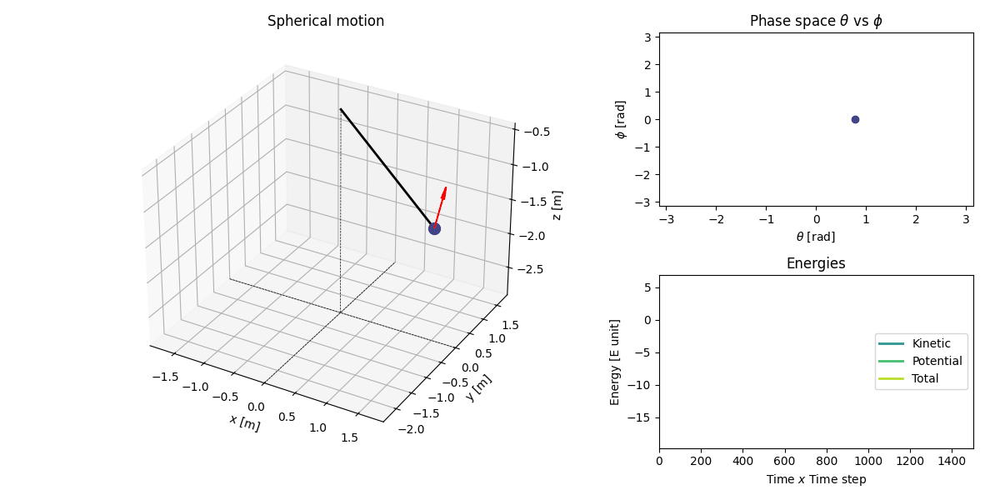 

*Note*: the red unit vector is the $U_{\theta}$.

$$
\ddot{\phi} = \frac{-2  \dot{\theta}  \dot{\phi}}{tan{\theta}}
$$

this equation describes how the axial angle change through time. But, if we look at it with good ayes, we would discover a critical point. When is the denominator equal to zero? When the angles is $-\frac{\pi}{2}$ or $\frac{\pi}{2}$. So, when it comes to happen, we have to jump it this issue with an interpolation.

$$
\ddot{\theta} = \frac{\dot{\phi}**2  sin(2  \theta)}{2} - \frac{g}{L} sin(\theta)
$$

These equations describe the motion of the spherical pendulum.

A curious description of this system is about angular conservation. The first equation can be written through Euler-Lagrangian equation:

$$
\partial{ml**2 sin(\theta) **2 \dot{\phi}}{t} = 0
$$

through this equation we can describe the efective potential like:

$$
ml**2 sin(\theta) **2 \dot{\phi} = J_z
$$
then:

$$
\dot{\phi} = \frac{J_z}{ml**2 sin(\theta)}
$$

and the second equation it reads as:

$$
\ddot{\theta} = \frac{J_z  sin(\phi)}{m**2 L**2 sin(\theta)**3} - \frac{g}{L} sin(\theta)
$$

These equations describe the full nonlinear dynamics of the system, and are typically solved using numerical methods.
There also exists a way to simplify these equations. Using the small-angle approximation, same masses, and same length. We can transform the nonlinear equation to a couple of:

$$
\ddot{\theta} = \frac{\dot{\phi}**2 2 \theta}{2} - frac{g}{L} \theta
$$

$$
\ddot{\phi} = {-2 \dot{\theta} \dot{\phi}}{\theta}
$$

  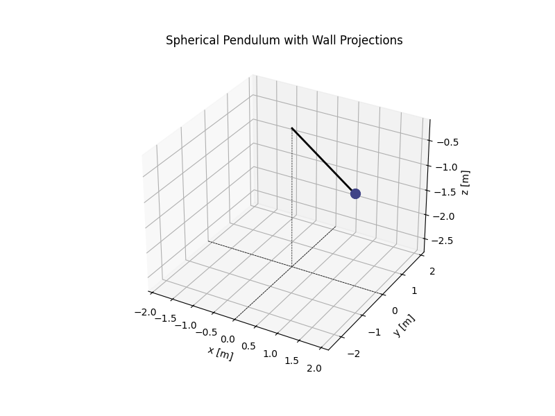 

## Numerical methods:

In this chapter (as always) we have to use numerical methods (or a piece of paper and hundreds of hour) to solve the system. In this case, we use: RK45, DOP853 and, our fantastic method, RK4. 

I wanted to bring this method back to show how badly works in different angles and with different scales. In this way, I want to remind, 4th Runge-Kutta method it could be use in some cases with good results, but when physic goes hard the method becomes inadequate.

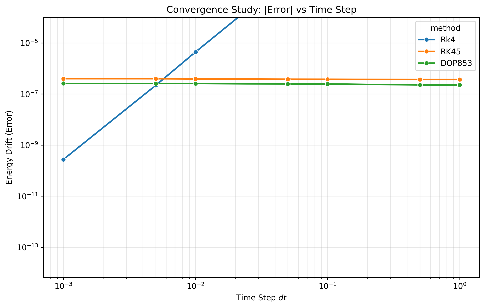
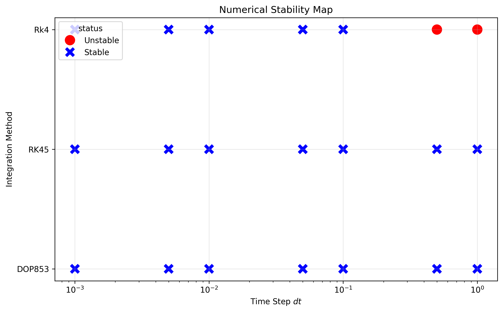
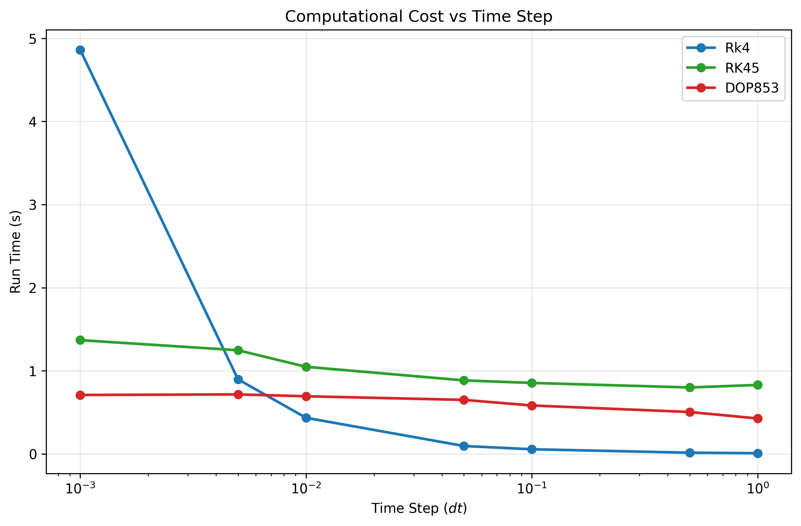

## Errors and analysis:
Now we have introduced the numerical methods, and which one is better than the other. We can wonder how well it perfoms.

*Note*: The graphics have been compute with this parameter: $t_max = 150$, ratol = 1e-10, atol = 1e-12, $m1.0$ $L_2 = 2.0$ and $dt =0.01$. However, in some error graphics we have to short the axes due to clarity.
For clarity in the right side we display the linearized equation, while in the left side display the normal equation.

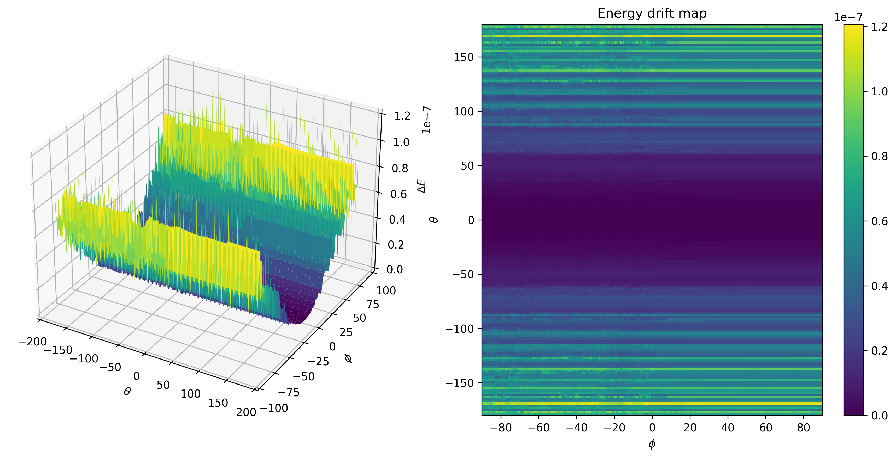
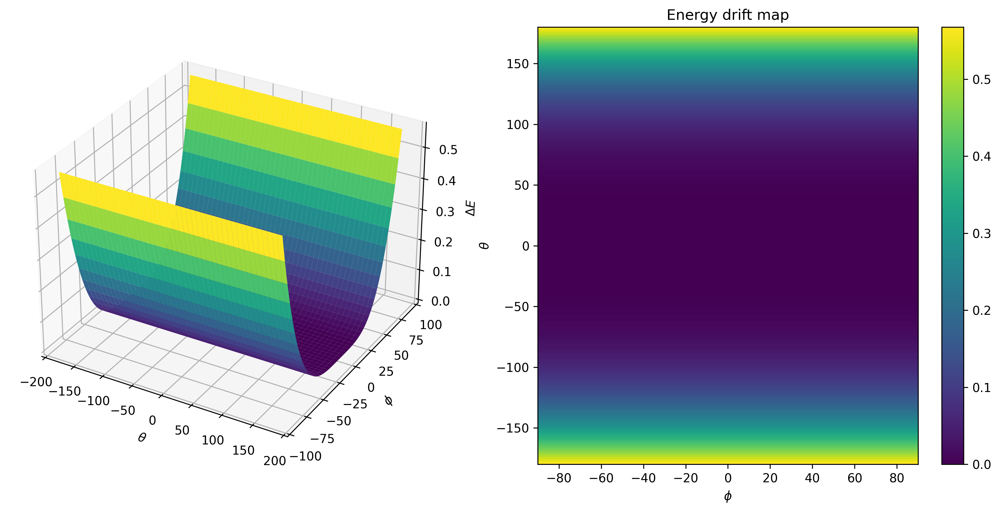

If we want a intersection plane:

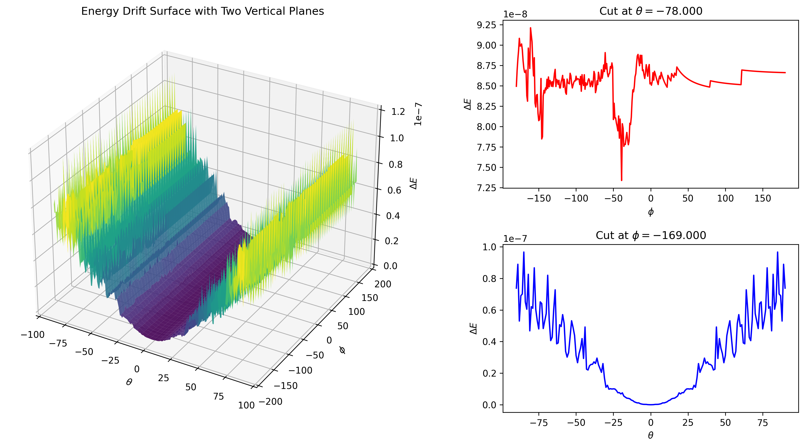
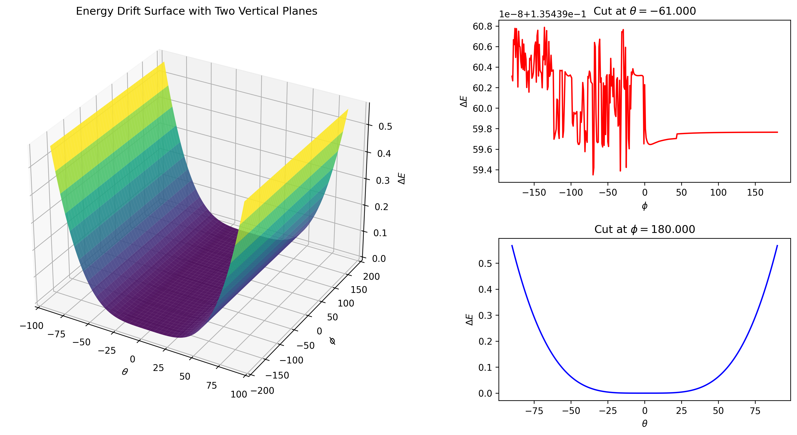

As we can see in the linearized graphics, the numerical methods *explots* when inital condition becomes bigger than twenty degrees or less. 

Once we discover when the method could be loss energy, and how it works thorugh different initial conditions, we can talk about two underlying motion: nutation and precession. 

**Nutation:** rocking, swaying, or nodding motion in the axis of rotation of an object, such as gyroscope.

**Precession:** continuous change in the orientation of a rotating body's axis

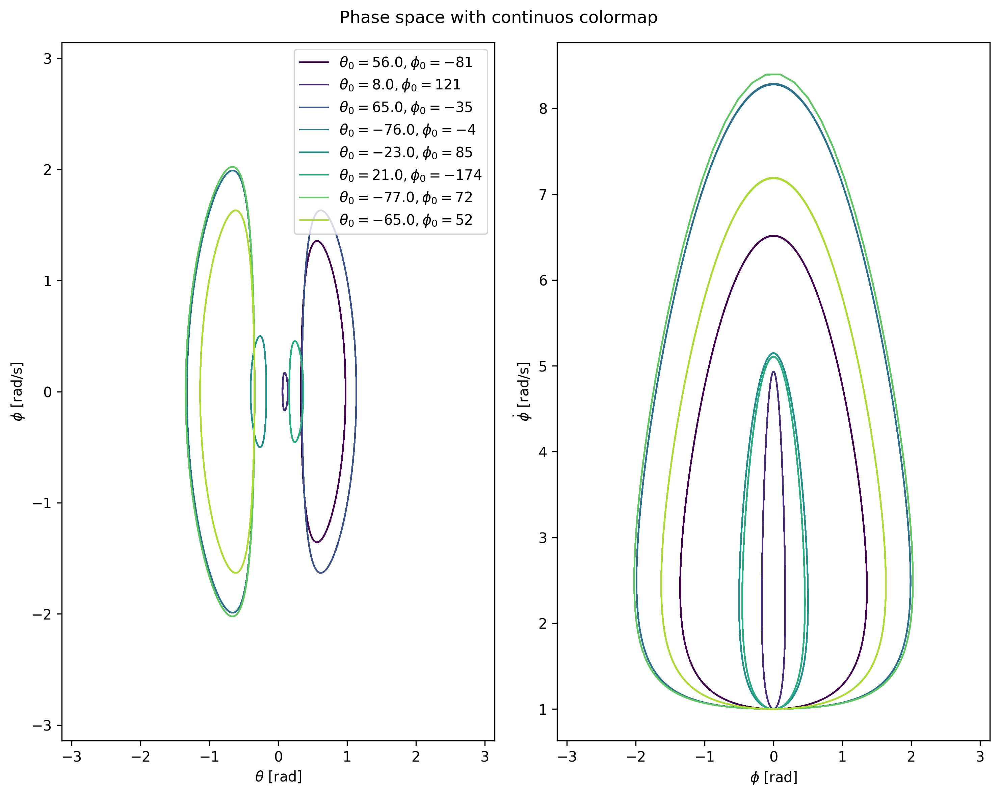
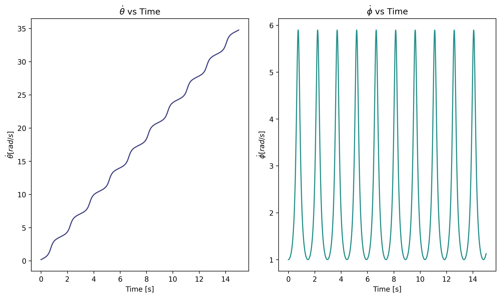
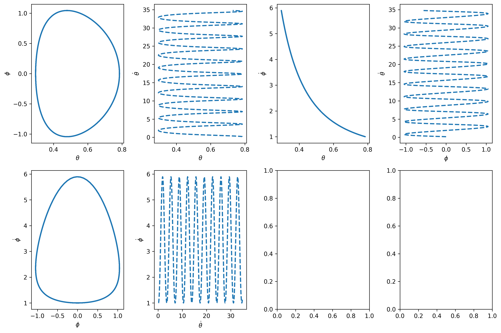

this two motion probabibly sounds familiar, due to the fact that this two motion, with others, describes the Earth movement.

